# TP1 — Implementación en FPGA (Basys3) de una ALU parametrizable, con un datapath de carga por switches/pulsadores y verificación por testbench autochequeado.

**Materia:** Arquitectura de Computadoras

**Carrera:** Ingeniería en Computación

**Alumnos:** Molina Maria Wanda - Verdú Melisa Noel

**Fecha de entraga:** 2 de septiembre de 2026

## Objetivo

Según el enunciado:

- Implementar en FPGA una ALU.
- Que la ALU sea parametrizable en ancho de bus de datos, para poder reutilizarse en el trabajo final.
- Validar el desarrollo con testbench, incluyendo generación de entradas aleatorias/dirigidas y chequeo automático.
- Simular el diseño en Vivado, incluyendo análisis de tiempo.

## Arquitectura general

Los datos A, B y el código de operación se ingresan por los switches de la Basys3 y se cargan a sus respectivos registros presionando un pulsador por campo (`btnL`→A, `btnC`→B, `btnR`→Op), en cualquier orden. La salida de la ALU se habilita recién cuando los tres campos ya fueron cargados al menos una vez, y queda habilitada de forma permanente (hasta el próximo reset): en cualquier momento se puede volver a presionar cualquiera de los tres botones para actualizar solo ese campo, reutilizando los otros dos. El resultado (más las banderas de overflow y carry) se muestra en los LEDs.

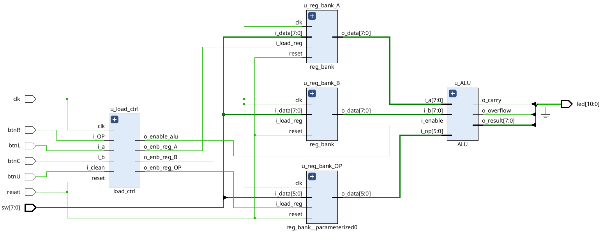

### Módulos

- **`debounce.v`**: antirrebote de 4 estados con detector de flanco integrado. Filtra los rebotes mecánicos de un pulsador y entrega un pulso de 1 ciclo (`db_tick`) por cada pulsación real, esperando `N` ciclos de clock de estabilidad antes de confirmarla (parametrizable, para poder usar un `N` chico en simulación y uno realista — ~21 ms con clock de 100 MHz — en la síntesis).
- **`load_ctrl.v`**: instancia un `debounce` por cada uno de los pulsadores de carga (A, B, Op) y tres flags "sticky" (uno por campo) que se levantan con su pulsador y solo se bajan con `reset`. La ALU se habilita cuando los tres flags están en 1 y queda habilitada así hasta el próximo reset; cualquiera de los tres botones puede volver a presionarse en cualquier momento (en cualquier orden) para actualizar solo su campo, reutilizando los otros dos sin resetear todo el sistema.

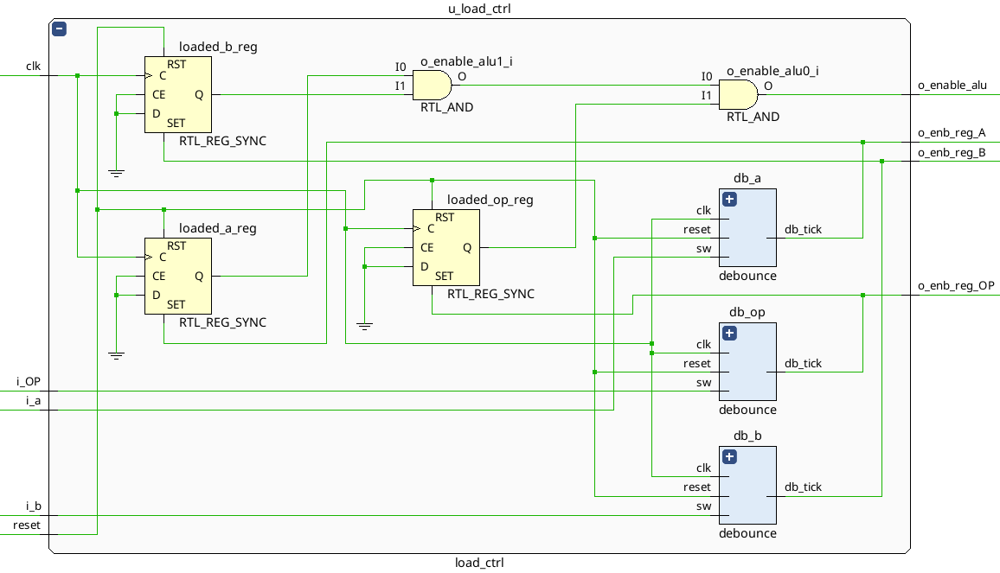

- **`reg_bank.v`**: registro genérico parametrizable por ancho (`WIDTH`), con reset y enable de carga síncronos. Se instancia tres veces (A, B y Op).
- **`ALU.v`**: puramente combinacional. Implementa las 8 operaciones del enunciado (ADD, SUB, AND, OR, XOR, SRA, SRL, NOR) y calcula overflow con signo y carry sin signo para ADD (con saturación al valor límite representable en caso de overflow). Si `i_enable` está en 0, fuerza la salida a 0.

  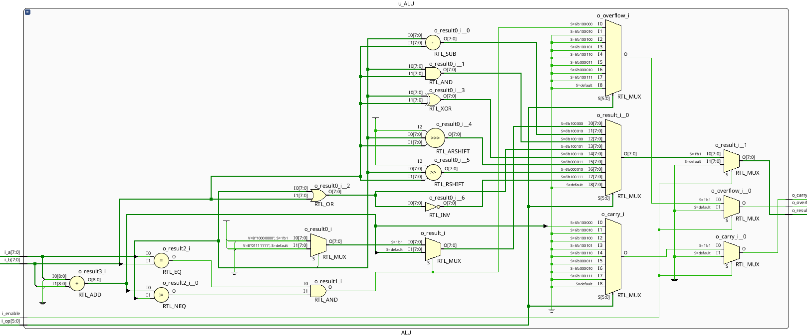

- **`top.v`**: conecta todo lo anterior con los pines físicos de la Basys3 y arma el vector de LEDs: `led[7:0]` = resultado, `led[8]` apagado (separador), `led[9]` = overflow, `led[10]` = carry.

## Mapeo de pines (Basys3)

Definido en `constraints/constraints.xdc`:

| Señal       | Función                                  | Pines Basys3                               |
| ----------- | ---------------------------------------- | ------------------------------------------ |
| `clk`       | Clock de 100 MHz                         | W5                                         |
| `reset`     | Reset síncrono                           | Botón inferior del d-pad (`btnD`, pin U17) |
| `sw[7:0]`   | Dato (A/B) u opcode (SW5-SW0)            | SW7-SW0                                    |
| `btnL`      | Cargar A                                 | Botón izquierdo                            |
| `btnC`      | Cargar B                                 | Botón central                              |
| `btnR`      | Cargar Op                                | Botón derecho                              |
| `led[10:0]` | Resultado + separador + overflow + carry | LD10-LD0                                   |

## Verificación

### `tb_ALU.v` — ALU combinacional aislada

Testbench autochequeado: aplica un estímulo por operación (incluyendo casos borde de overflow/carry en ADD, `i_enable=0` y un opcode inválido) y compara automáticamente la salida esperada contra la obtenida. Además corre un bloque de **300 entradas aleatorias** (`a`, `b`, `op`, `i_enable` generados con `$random`) autochequeadas contra un modelo de referencia (`ref_model`) que recalcula la especificación de forma independiente del RTL, cumpliendo el punto del enunciado sobre generación de entradas aleatorias.

> Las capturas de waveform por operación de esta sección son de la versión anterior del testbench (solo con los casos dirigidos, sin el bloque aleatorio). Se dejan igual porque muestran con claridad, caso por caso, el comportamiento correcto de cada operación — algo que el bloque aleatorio no permite visualizar tan fácilmente al ser 300 estímulos. El log de consola más abajo sí corresponde a la versión actual, con los 325 casos (25 dirigidos + 300 aleatorios).

Formas de onda de la simulación (`i_a`, `i_b`, `o_result` en decimal con signo — o en binario para las operaciones bit a bit y de shift, donde importa ver cada bit —, `i_op` en hexadecimal, `i_enable`/`o_overflow`/`o_carry` en binario):

**ADD** — caso básico, carry sin overflow (`-1+1`) y overflow con saturación positiva (`127+1`, `127+127`) y negativa (`-128+-128`):

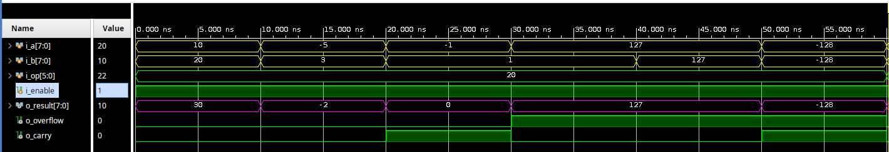

**SUB** — casos básicos con resultado positivo, negativo y cero:

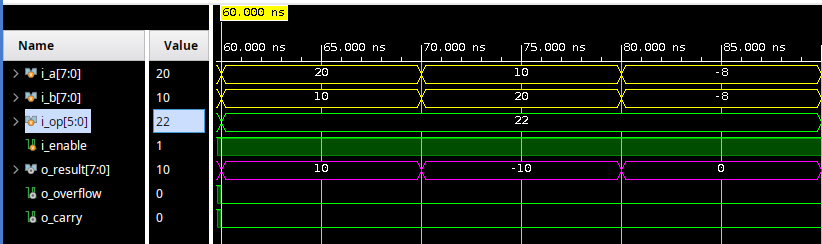

**AND y OR**:

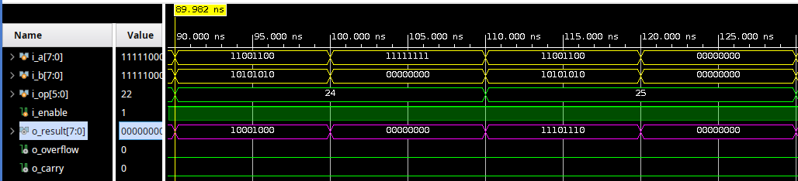

**XOR**:

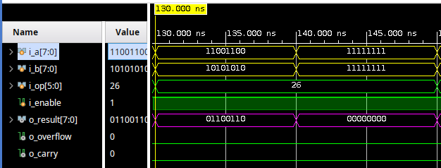

**SRA y SRL** — mismo patrón de bits desplazado con y sin extensión de signo:

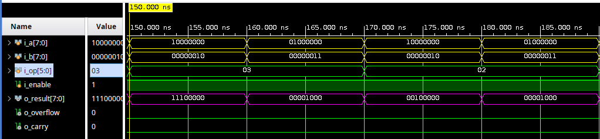

**Cola de SRL y NOR**:

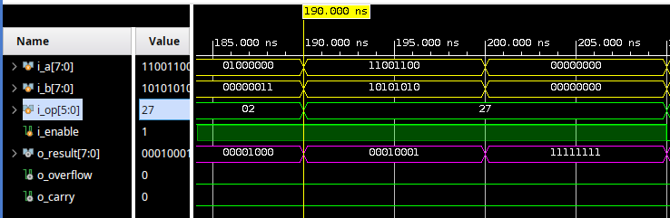

**`i_enable=0`** (fuerza `o_result=0` incluso con condición de overflow) **y opcode inválido** (cae en el `default` del `case`):

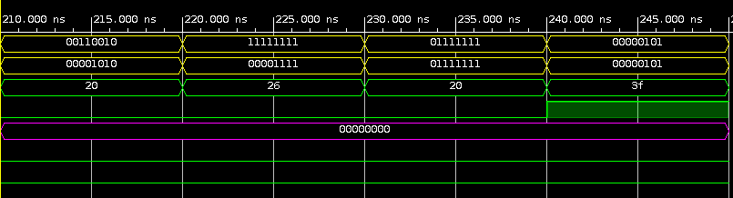

Resultado en consola de esa versión anterior (solo dirigidos): **25/25 casos pasaron**.

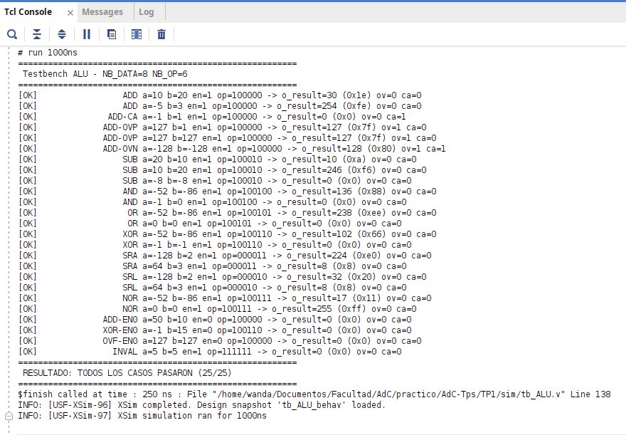

#### Resultado actual, con el bloque de entradas aleatorias

```
========================================================
 Testbench ALU - NB_DATA=8 NB_OP=6
========================================================
[OK]                 ADD a=10 b=20 en=1 op=100000 -> o_result=30 (0x1e) ov=0 ca=0
[OK]                 ADD a=-5 b=3 en=1 op=100000 -> o_result=254 (0xfe) ov=0 ca=0
[OK]              ADD-CA a=-1 b=1 en=1 op=100000 -> o_result=0 (0x0) ov=0 ca=1
[OK]             ADD-OVP a=127 b=1 en=1 op=100000 -> o_result=127 (0x7f) ov=1 ca=0
[OK]             ADD-OVP a=127 b=127 en=1 op=100000 -> o_result=127 (0x7f) ov=1 ca=0
[OK]             ADD-OVN a=-128 b=-128 en=1 op=100000 -> o_result=128 (0x80) ov=1 ca=1
[OK]                 SUB a=20 b=10 en=1 op=100010 -> o_result=10 (0xa) ov=0 ca=0
[OK]                 SUB a=10 b=20 en=1 op=100010 -> o_result=246 (0xf6) ov=0 ca=0
[OK]                 SUB a=-8 b=-8 en=1 op=100010 -> o_result=0 (0x0) ov=0 ca=0
[OK]                 AND a=-52 b=-86 en=1 op=100100 -> o_result=136 (0x88) ov=0 ca=0
[OK]                 AND a=-1 b=0 en=1 op=100100 -> o_result=0 (0x0) ov=0 ca=0
[OK]                  OR a=-52 b=-86 en=1 op=100101 -> o_result=238 (0xee) ov=0 ca=0
[OK]                  OR a=0 b=0 en=1 op=100101 -> o_result=0 (0x0) ov=0 ca=0
[OK]                 XOR a=-52 b=-86 en=1 op=100110 -> o_result=102 (0x66) ov=0 ca=0
[OK]                 XOR a=-1 b=-1 en=1 op=100110 -> o_result=0 (0x0) ov=0 ca=0
[OK]                 SRA a=-128 b=2 en=1 op=000011 -> o_result=224 (0xe0) ov=0 ca=0
[OK]                 SRA a=64 b=3 en=1 op=000011 -> o_result=8 (0x8) ov=0 ca=0
[OK]                 SRL a=-128 b=2 en=1 op=000010 -> o_result=32 (0x20) ov=0 ca=0
[OK]                 SRL a=64 b=3 en=1 op=000010 -> o_result=8 (0x8) ov=0 ca=0
[OK]                 NOR a=-52 b=-86 en=1 op=100111 -> o_result=17 (0x11) ov=0 ca=0
[OK]                 NOR a=0 b=0 en=1 op=100111 -> o_result=255 (0xff) ov=0 ca=0
[OK]             ADD-EN0 a=50 b=10 en=0 op=100000 -> o_result=0 (0x0) ov=0 ca=0
[OK]             XOR-EN0 a=-1 b=15 en=0 op=100110 -> o_result=0 (0x0) ov=0 ca=0
[OK]             OVF-EN0 a=127 b=127 en=0 op=100000 -> o_result=0 (0x0) ov=0 ca=0
[OK]               INVAL a=5 b=5 en=1 op=111111 -> o_result=0 (0x0) ov=0 ca=0
--------------------------------------------------------
 Bloque de 300 entradas aleatorias (a, b, op, i_enable con $random)
 Bloque aleatorio: 300 casos ejecutados
========================================================
 RESULTADO: TODOS LOS CASOS PASARON (325/325)
========================================================
```

#### Simulación behavioral vs. post-implementación con timing

Para completar el punto del enunciado sobre simular "incluyendo análisis de tiempo", se corrió `tb_ALU.v` en dos modos de simulación de Vivado: **Behavioral** (RTL puro, sin retardos) y **Post-Implementation Timing** (sobre el netlist ya ruteado). Los primeros casos dirigidos dan exactamente el mismo resultado en ambas — confirma que los retardos reales no introducen ningún glitch ni carrera que rompa la lógica a la frecuencia de clock usada:

**Behavioral** (nombres de señal completos, sin sufijos de netlist):

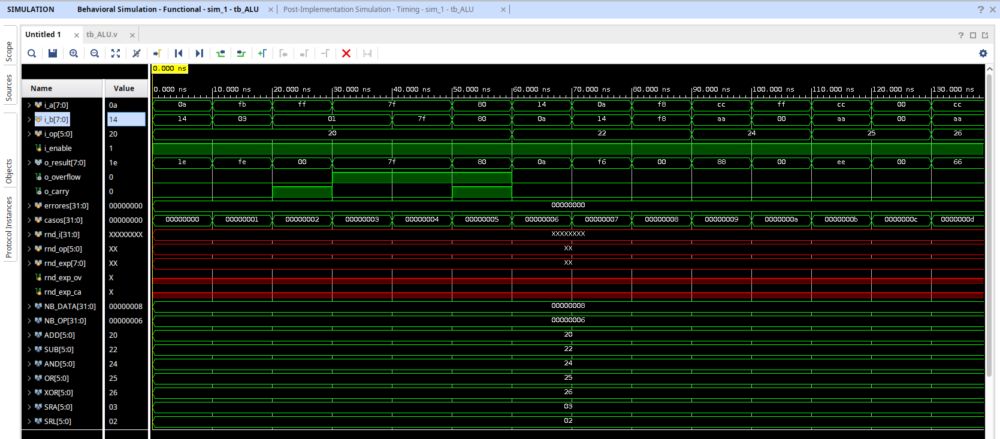

**Post-Implementation Timing** (mismos estímulos, netlist post-síntesis/implementación):

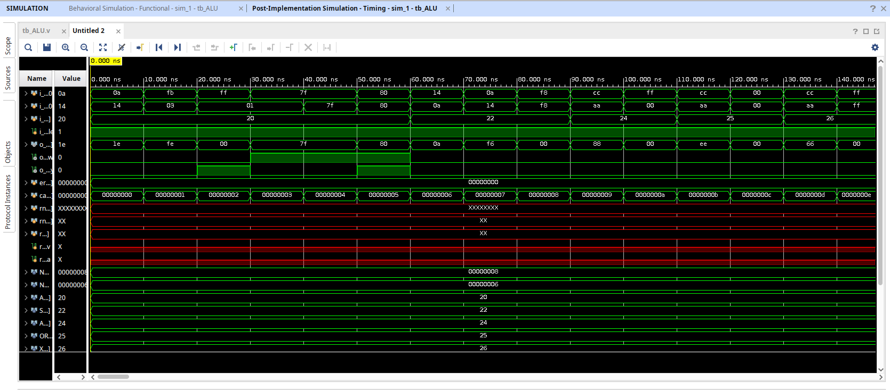

### `tb_top.v` — sistema completo (datapath + control)

Simula la secuencia real de carga por switches y pulsadores (con antirrebote modelado, incluyendo rebotes simulados y pulsos por debajo del umbral de confirmación), los flags "sticky" de `load_ctrl` que habilitan la ALU en cualquier orden de carga, el latcheo de A/B/Op una vez habilitada, el reset a mitad de carga y la reutilización de campos individuales sin perder la habilitación. `N_DEBOUNCE` se reduce solo para esta instancia de simulación, para no tener que esperar los ~21 ms reales del antirrebote de hardware.

## Resultados

- **`tb_ALU.v`**: **325/325 casos pasaron** (25 dirigidos — las 8 operaciones, casos borde de overflow/carry en ADD con y sin saturación, `i_enable=0`, opcode inválido — más 300 aleatorios autochequeados contra `ref_model`).
- **`tb_top.v`**: datapath completo, latcheo de registros, antirrebote real con rebotes simulados, reset a mitad de carga y reutilización de A/B/Op en cualquier orden — casos y log de consola pendientes de re-ejecutar tras el cambio de `load_ctrl.v` (ver nota en [Verificación](#verificación)).
- Síntesis, implementación y generación de bitstream completadas sin errores en Vivado; validado en hardware sobre la Basys3.
- Simulación post-implementación con timing corrida sobre `tb_ALU.v`: mismos resultados que en behavioral. Timing Summary sin violaciones — **WNS 5.303 ns / WHS 0.268 ns / WPWS 4.500 ns, 0 endpoints fallando** en Setup, Hold y Pulse Width ("All user specified timing constraints are met").

## Cómo simular / sintetizar

1. Agregar como fuentes de diseño todos los archivos de `rtl/`.
2. Agregar `sim/tb_ALU.v` y/o `sim/tb_top.v` como fuente de simulación (según qué testbench se quiera correr) y ejecutar la simulación de comportamiento en Vivado.
3. Para hardware: agregar `constraints/constraints.xdc`, correr síntesis + implementación, generar bitstream y programar la Basys3.

### Simulación con análisis de tiempo

El enunciado pide simular "incluyendo análisis de tiempo", distinto de la simulación de comportamiento (que no modela retardos reales). Pasos seguidos en Vivado:

1. Correr **Run Synthesis** y luego **Run Implementation** (Flow Navigator).
2. En el desplegable de **Run Simulation** (Flow Navigator → Simulation), elegir **Post-Implementation Timing Simulation** en vez de la _Behavioral_ de siempre — simula el netlist ya ruteado, con el SDF de retardos reales back-anotado. Waveform comparada contra behavioral en la sección `tb_ALU.v` de [Verificación](#verificación) más arriba, mismo resultado en ambas.
3. Abrir el **Timing Summary** (post-implementación) y confirmar que no haya _timing violations_ para el `create_clock` de 100 MHz definido en `constraints.xdc`:

   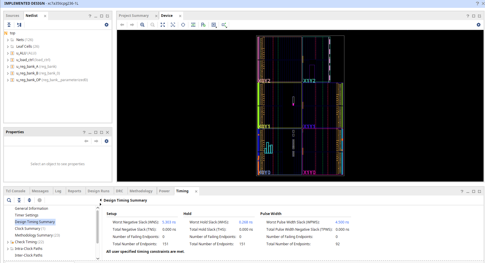

   **Setup** — WNS: 5.303 ns, TNS: 0.000 ns, 0/151 endpoints fallando · **Hold** — WHS: 0.268 ns, THS: 0.000 ns, 0/151 endpoints fallando · **Pulse Width** — WPWS: 4.500 ns, TPWS: 0.000 ns, 0/92 endpoints fallando. _"All user specified timing constraints are met."_

## Guía de casos de prueba en la FPGA

Procedimiento general (ver [Mapeo de pines](#mapeo-de-pines-basys3)):

1. Presionar **btnD** (reset) para limpiar todo (registros en 0, ALU deshabilitada).
2. Configurar **SW7-SW0** = A, presionar **btnL**.
3. Configurar **SW7-SW0** = B, presionar **btnC**.
4. Configurar **SW5-SW0** = Op (SW7/SW6 no importan), presionar **btnR** → el resultado queda fijo en los LEDs. Los pasos 2-4 pueden hacerse en cualquier orden; la ALU se habilita recién cuando los tres ya fueron cargados una vez.
5. Para probar otro caso: presionar **btnD** (borra todo) o volver a presionar solo el botón del campo que se quiera cambiar (los otros dos se reutilizan tal cual estaban).

Los pulsadores tienen antirrebote real (~21 ms); un toque normal alcanza, no hace falta mantenerlos apretados.

### Casos por operación

| #   | Operación                       | SW7654 3210 (A)    | SW7654 3210 (B)    | SW5-SW0 (Op) | LD7-LD0 esperado   | LD9 (ov) | LD10 (ca) |
| --- | ------------------------------- | ------------------ | ------------------ | ------------ | ------------------ | -------- | --------- |
| 1   | ADD básica                      | `0000 1010` (10)   | `0001 0100` (20)   | `100000`     | `0001 1110` (30)   | 0        | 0         |
| 2   | ADD, carry sin overflow         | `1111 1111` (-1)   | `0000 0001` (1)    | `100000`     | `0000 0000` (0)    | 0        | 1         |
| 3   | ADD, overflow positivo (satura) | `0111 1111` (127)  | `0000 0001` (1)    | `100000`     | `0111 1111` (127)  | 1        | 0         |
| 4   | ADD, overflow negativo (satura) | `1000 0000` (-128) | `1000 0000` (-128) | `100000`     | `1000 0000` (-128) | 1        | 1         |
| 5   | SUB, resultado positivo         | `0001 0100` (20)   | `0000 1010` (10)   | `100010`     | `0000 1010` (10)   | 0        | 0         |
| 6   | SUB, resultado negativo         | `0000 1010` (10)   | `0001 0100` (20)   | `100010`     | `1111 0110` (-10)  | 0        | 0         |
| 7   | AND                             | `1100 1100`        | `1010 1010`        | `100100`     | `1000 1000`        | 0        | 0         |
| 8   | OR                              | `1100 1100`        | `1010 1010`        | `100101`     | `1110 1110`        | 0        | 0         |
| 9   | XOR                             | `1100 1100`        | `1010 1010`        | `100110`     | `0110 0110`        | 0        | 0         |
| 10  | SRA (extiende signo)            | `1000 0000` (-128) | `0000 0010` (2)    | `000011`     | `1110 0000` (-32)  | 0        | 0         |
| 11  | SRL (no extiende signo)         | `1000 0000`        | `0000 0010` (2)    | `000010`     | `0010 0000` (32)   | 0        | 0         |
| 12  | NOR                             | `0000 0000`        | `0000 0000`        | `100111`     | `1111 1111` (255)  | 0        | 0         |

`LD8` tiene que quedar **apagado siempre** (es el separador entre resultado y banderas); si se enciende, hay un problema de mapeo de pines.

### Casos de control (carga libre / antirrebote)

| #   | Procedimiento                                                                                                                  | Resultado esperado                                                                                                               |
| --- | ------------------------------------------------------------------------------------------------------------------------------ | -------------------------------------------------------------------------------------------------------------------------------- |
| 13  | Cargar A, B, Op (cualquier caso de la tabla) y, ya con el resultado en los LEDs, mover los switches sin presionar ningún botón | El resultado en los LEDs **no cambia** (A/B/Op quedan latcheados hasta el próximo `btnL`/`btnC`/`btnR`)                          |
| 14  | Con un resultado ya mostrado, cambiar **SW5-SW0** a otra operación y presionar solo **btnR**                                   | El resultado se recalcula con la nueva Op, reutilizando A y B tal cual estaban cargados (no hace falta volver a tocar btnL/btnC) |
| 15  | Cargar solo A (presionar btnL) y luego presionar **btnD** (reset) antes de cargar B                                            | Todos los LEDs quedan apagados y hay que volver a cargar A, B y Op desde cero (el reset borra los registros y la habilitación)   |
| 16  | Cargar Op primero, después B, y por último A (orden distinto al de la tabla de pines)                                          | La ALU igual se habilita recién al completar el tercer campo, sin importar en qué orden se cargó cada uno                        |
