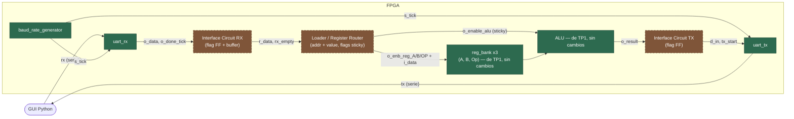
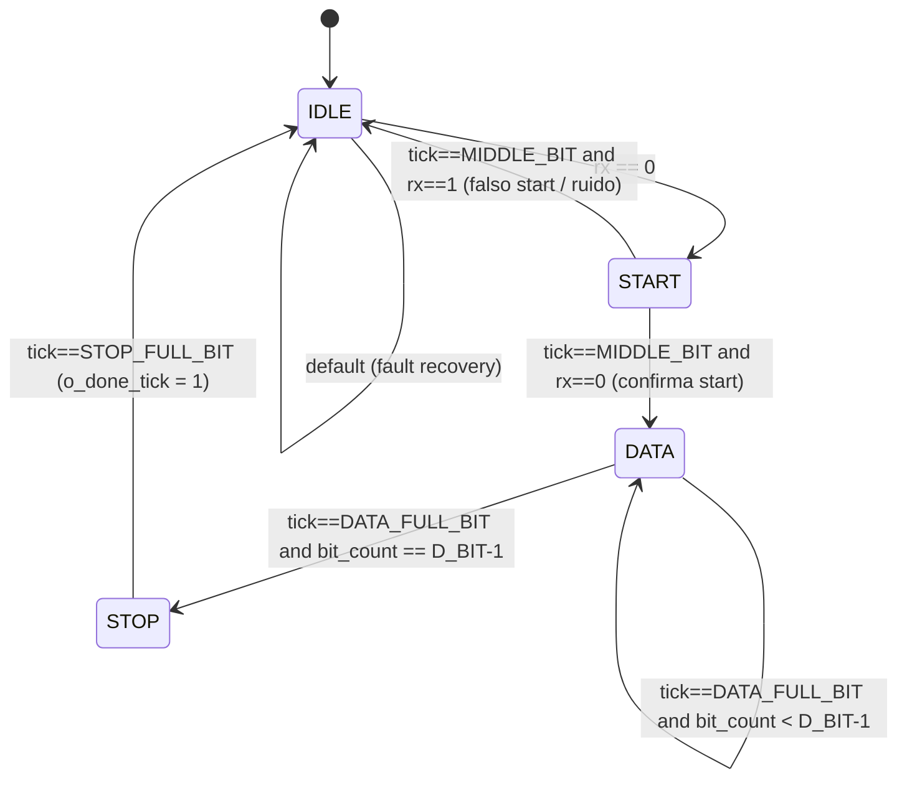
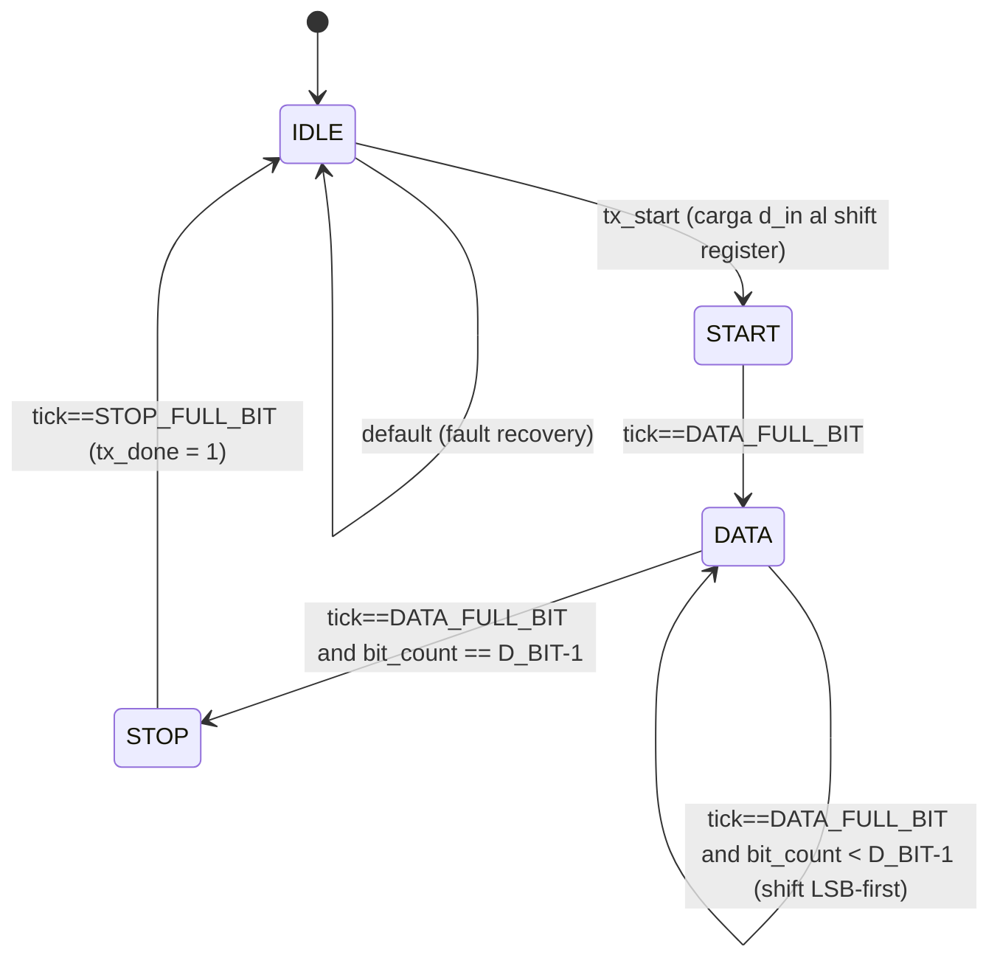
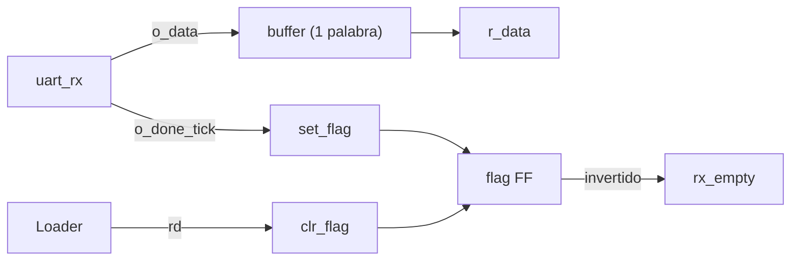
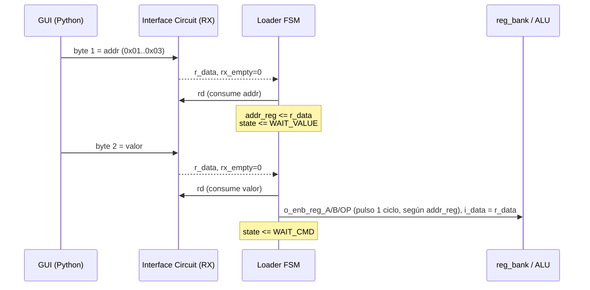
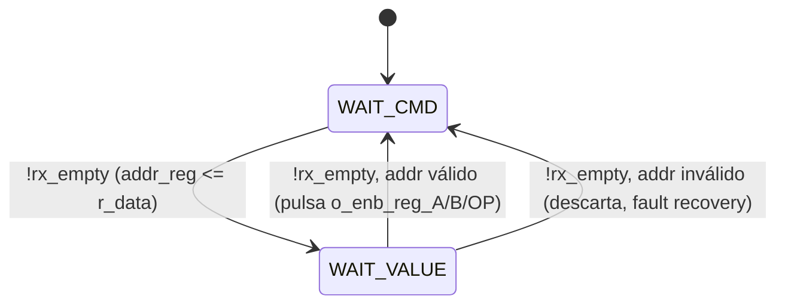
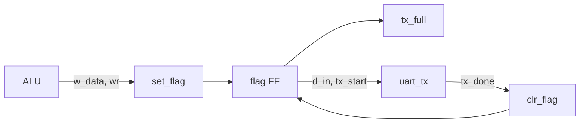
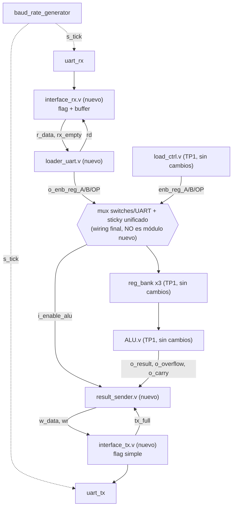

# TP2 — UART (Baud Rate Generator, Rx, Tx) integrada a la ALU de TP1

**Materia:** Arquitectura de Computadoras

**Carrera:** Ingeniería en Computación

**Alumnas:** Molina Maria Wanda - Verdú Melisa Noel

## Objetivo

Según la consigna (`consigna_tp2_uart.md`):

- Diseñar e implementar en Verilog, modelando cada bloque como una **FSM explícita** (lógica de próximo estado / registro de estado / lógica de salida separados, con `parameter`/`localparam` para los estados y un estado de recuperación ante entrada inválida), un módulo de comunicación serie **UART**.
- Integrarlo a la arquitectura de la ALU de [TP1](../TP1/README.md) (ALU + Interface Circuit + UART), reemplazando la carga por switches/pulsadores por una carga serie manejada desde una **GUI en Python**.

## Arquitectura general



🟢 Verde = ya implementado y testeado · 🟤 Marrón punteado = decidido en diseño, todavía no escrito en código (ver [Pendiente](#pendiente--próximos-pasos)).

Esto reemplaza al datapath de entrada de TP1, donde A/B/Op se cargaban con switches + un pulsador dedicado por campo (`btnL`/`btnC`/`btnR`). La versión final de `load_ctrl.v` (ver [TP1](../TP1/README.md)) ya permite cargar los tres campos **en cualquier orden**, con flags "sticky" que habilitan la ALU de forma permanente una vez que los tres se cargaron alguna vez, y que se pueden recargar individualmente sin perder la habilitación — no hay más botón de "clean" (`btnU`), se sacó al simplificar `load_ctrl.v`.

Esto es una simplificación importante para el diseño de la interfaz UART: como TP1 ya resuelve la carga libre (sin importar el orden) a nivel de ALU, el Loader de este TP2 **no necesita reinventar eso**, solo necesita reproducir el mismo patrón (flags sticky + habilitación combinacional) pero alimentado por los pulsos que arman `addr`+`valor` en vez de por botones físicos — sin comando de "ejecutar" explícito, igual que en TP1 (ver [Protocolo de direccionamiento](#protocolo-de-direccionamiento-comando-dirección--valor-2-bytes)).

## Estado actual de la implementación

| Módulo | Estado | Testbench |
|---|---|---|
| `baud_rate_generator.v` | ✅ Implementado | ✅ `tb_baud_rate_generator.v` — pasa |
| `uart_rx.v` | ✅ Implementado | ✅ `tb_uart_rx.v` — pasa |
| `uart_tx.v` | ✅ Implementado | ✅ `tb_uart_tx.v` — pasa (ver nota en [Verificación](#verificación)) |
| Interface Circuit (RX: flag FF + buffer) | 📋 Diseñado, no implementado | — |
| Interface Circuit (TX: flag FF simple) | 📋 Diseñado, no implementado | — |
| Loader / Register Router (protocolo addr+valor, flags sticky) | 📋 Diseñado, no implementado | — |
| `top.v` (integración con TP1) | ⛔ No iniciado | — |
| GUI en Python | ⛔ No iniciado | — |

## Módulos implementados

### `baud_rate_generator.v`

Contador módulo `N` que genera `s_tick` 16 veces por bit (sobremuestreo `OVERSAMPLE=16`). Con los valores por defecto (`CLK_FREQ=100e6`, `BAUD_RATE=19200`):

```
N = CLK_FREQ / (BAUD_RATE × OVERSAMPLE) = 100.000.000 / (19.200 × 16) = 325 (truncado)
```

Verificado por `tb_baud_rate_generator.v`: confirma que los 16 ticks de un período de bit caen cada 325 ciclos de clock exactos (16/16 intervalos correctos).

### `uart_rx.v`

FSM de 4 estados (`IDLE → START → DATA → STOP`), fiel al diagrama ASM de la consigna. Estructurada en **3 procesos separados**, como pide la sección 2 de la consigna:

1. `always @(posedge clk)` — registro de estado y de los contadores (`state_reg`, `tick_count`, `bit_count`, `o_data`).
2. `always @(*)` — lógica de cambio de estado: calcula `state_next`, `tick_count_next` y `bit_count_next` (los "próximo valor" de todo lo que es registro interno de la FSM).
3. `always @(*)` — lógica de salida: solo toca las salidas reales del módulo, `o_done_tick` y `data` (que alimenta `o_data`).



`D_BIT=8`, `SB_TICK=16` (1 stop bit), **sin bit de paridad** (la consigna lo marca opcional; no se requiere para el protocolo de la sección "Decisiones de diseño de la interfaz" de este documento, que ya valida los bytes por su dirección/campo, no por paridad).

### `uart_tx.v`

FSM análoga a la de `uart_rx.v`, en sentido inverso: arma la trama de salida a partir de `d_in`, disparada por `tx_start`.



`tx` es una salida registrada (`tx_reg`) para evitar glitches en el pin físico — esto introduce 1 ciclo de clock de latencia entre el cambio de estado interno y el reflejo en `tx`, que es la causa de las fallas del testbench (ver [Verificación](#verificación)).

## Decisiones de diseño de la interfaz

Discutidas antes de escribir código, para no tener que rehacer el Interface Circuit una vez implementado.

### Camino Rx → ALU: `flag FF + buffer de una palabra`

De los 3 esquemas del libro de referencia (`docs/FPGAPrototypingByVerilogExamples.pdf`, sección 8.2.4): **flag FF sola**, **flag FF + buffer de 1 palabra** y **FIFO**.

Se descartó *flag FF sola* porque expone directamente el registro interno del receptor (riesgo de overrun si llega una trama nueva antes de leer la anterior) y se descartó la *FIFO* por ser más lógica de la que pide la consigna ("protocolo simple de handshake"). El nombrado de señales de la consigna (`r_data`, `rd`, `rx_empty`) además calza 1 a 1 con el esquema de flag+buffer (Listing 8.2 del libro, módulo `flag_buf`), no con una FIFO.



### Protocolo de direccionamiento: comando (dirección) + valor, 2 bytes

Una GUI no tiene "un pulsador por campo": tiene que poder decir explícitamente a qué campo se refiere cada valor, y poder actualizar un solo operando sin reenviar los otros. Por eso el frame UART se extiende a nivel de protocolo (no a nivel de framing físico, que sigue siendo 1 byte = 1 start + 8 datos + 1 stop) con una capa de 2 bytes: **dirección** + **valor**.

| `addr` (byte 1) | Destino | Byte de valor (byte 2) |
|---|---|---|
| `0x01` | `opcode` | se carga en el registro de opcode (6 bits menos significativos del byte) |
| `0x02` | operando A | se carga en `reg_bank` de A |
| `0x03` | operando B | se carga en `reg_bank` de B |
| cualquier otro | inválido | se descarta, vuelve a `WAIT_CMD` (fault recovery) |

No hace falta un comando `EXEC` — la versión final de `load_ctrl.v` en TP1 ya no dispara la ALU al completar una secuencia fija, sino que la habilita de forma **sticky**: apenas A, B y Op fueron cargados alguna vez (en cualquier orden), la ALU queda habilitada para siempre (hasta el próximo reset), y al ser puramente combinacional, `o_result` se recalcula solo con recargar cualquier campo. El Loader de este TP2 reproduce exactamente ese mismo patrón (ver más abajo), así que "cargar el tercer campo pendiente" ya alcanza para que el resultado esté disponible — no hay un paso de "ejecutar" separado de "cargar".



La FSM del Loader necesita solo 2 estados (no un contador genérico), consistente con exigir FSM explícita en todo el diseño (sección 2 de la consigna) y con tener un estado de recuperación ante una dirección inválida:



El `reg_bank.v` de TP1 se reutiliza tal cual — su interfaz (`i_data`, `i_load_reg` de 1 ciclo, `o_data`) ya es exactamente lo que el Loader necesita manejar para A/B/Op.

### Enable de la ALU: se replica el patrón sticky de `load_ctrl.v`, no se instancia tal cual

`load_ctrl.v` de TP1 no es reutilizable tal cual acá: internamente instancia un `debounce` por entrada, pensado para filtrar rebotes mecánicos de un botón físico durante varios ciclos. Los pulsos que arma el Loader al decodificar `addr`+`valor` ya llegan limpios y de 1 ciclo (no hay rebote que filtrar), así que pasarlos por un `debounce` solo agregaría una demora de `N_DEBOUNCE` ciclos innecesaria.

Lo que sí se replica es el **patrón combinacional de flags sticky** de `load_ctrl.v` — 3 flags (`loaded_a`, `loaded_b`, `loaded_op`) que se levantan la primera vez que se pulsa el `o_enb_reg_*` correspondiente y solo bajan con `reset`, con `o_enable_alu = loaded_a & loaded_b & loaded_op`. El Loader del UART termina exponiendo exactamente las mismas 4 salidas que `load_ctrl.v` (`o_enb_reg_A`, `o_enb_reg_B`, `o_enb_reg_OP`, `o_enable_alu`), así que se conecta a `reg_bank`/`ALU` con el mismo patrón de instanciación que ya usa `top.v` de TP1 — solo cambia qué genera esos pulsos (decodificación de `addr` en vez de botones antirrebotados).

### Camino ALU → Tx: `flag FF simple` (sin buffer)

Mismo menú de esquemas, aplicado al revés: acá es la ALU la que setea el flag (`wr` + `w_data`) y `uart_tx` el que lo limpia. Se evaluaron dos variantes:

- **Flag simple, limpia con `tx_done`**: `tx_full` quedaría en 1 desde que la ALU escribe hasta que termina de transmitirse la trama completa. No requiere tocar `uart_tx.v`.
- **Flag + buffer real** (mismo colchón de 1 palabra que del lado Rx): permitiría a la ALU cargar el siguiente resultado mientras el anterior todavía se transmite, pero exige agregarle a `uart_tx.v` una salida de "estoy libre" que hoy no tiene (solo expone `tx_done`, al final de la trama).

**Se eligió flag simple**: la GUI en Python manda comandos a ritmo humano, no a velocidad de línea, así que el pipelining no aporta nada acá y esta opción no requiere modificar `uart_tx.v`.



## Módulos nuevos a agregar

**Decidido**: 4 módulos nuevos, sin fusionar, **sin capa `uart.v`** — `interface_rx.v`/`interface_tx.v` se conectan directo a `uart_rx.v`/`uart_tx.v`, sin ningún wrapper intermedio. Cada uno tiene su propia sub-issue. El wiring final (instanciar los 4 + `load_ctrl.v`/`reg_bank.v`/`ALU.v` de TP1, mux switches/UART, constraints `.xdc`) queda aparte, todavía sin issue propia.

**Fuera de este alcance:** la GUI en Python no es RTL — no agrega módulos ni complejidad a la arquitectura digital, solo es el software que arma los bytes `addr`+`valor` del lado de la PC.



El mux preserva la interfaz física de TP1: `load_ctrl.v` (switches/botones) y `loader_uart.v` (UART) quedan como dos fuentes hermanas compitiendo por los mismos `reg_bank`, ninguna reemplaza a la otra — se puede seguir usando la FPGA a mano exactamente como en TP1. Ojo con el enable: tiene que ser un solo sticky unificado en el wiring final (seteado por *cualquiera* de las dos fuentes por campo), no un OR de dos sticky ya calculados por separado — si no, una carga mixta (ej. A por switch, B y Op por UART) nunca habilita la ALU.

### 1. `interface_rx.v`

Genérico, no conoce A/B/Op — esquema *flag FF + buffer* (sección [Camino Rx → ALU](#camino-rx--alu-flag-ff--buffer-de-una-palabra) más arriba). Se conecta directo a `uart_rx.v`.

| Puerto | Dirección | Descripción |
|---|---|---|
| `clk`, `reset` | in | — |
| `i_rx_data[7:0]` | in | `o_data` de `uart_rx.v` |
| `i_rx_done_tick` | in | `o_done_tick` de `uart_rx.v` (`set_flag`) |
| `i_rd` | in | pulso de 1 ciclo: "ya leí el dato" (`clr_flag`), lo maneja `loader_uart.v` |
| `o_r_data[7:0]` | out | dato bufferizado |
| `o_rx_empty` | out | `~flag_reg` |

Estructura interna: 1 registro de 8 bits (buffer) + 1 flip-flop (flag). Sin FSM propiamente dicha — es el módulo `flag_buf` del libro, casi sin lógica de próximo estado más allá del set/clear del flag.

### 2. `interface_tx.v`

Simétrico, esquema *flag FF simple*. Se conecta directo a `uart_tx.v`.

| Puerto | Dirección | Descripción |
|---|---|---|
| `clk`, `reset` | in | — |
| `i_w_data[7:0]` | in | dato a transmitir |
| `i_wr` | in | pulso de 1 ciclo: "quiero transmitir esto" (`set_flag`), lo maneja `result_sender.v` |
| `i_tx_done` | in | de `uart_tx.v` (`clr_flag`) |
| `o_tx_full` | out | `flag_reg` |
| `o_d_in[7:0]` | out | hacia `d_in` de `uart_tx.v` |
| `o_tx_start` | out | hacia `tx_start` de `uart_tx.v` (nivel, se mantiene en 1 mientras `flag_reg`; `uart_tx.v` lo captura solo cuando está en `IDLE`) |

Misma complejidad que (1): 1 registro + 1 flip-flop, sin FSM propia.

### 3. `loader_uart.v`

FSM `addr`+`valor` con flags sticky — ya documentado en detalle en [Protocolo de direccionamiento](#protocolo-de-direccionamiento-comando-dirección--valor-2-bytes) y [Enable de la ALU](#enable-de-la-alu-se-replica-el-patrón-sticky-de-load_ctrlv-no-se-instancia-tal-cual) más arriba.

| Puerto | Dirección | Descripción |
|---|---|---|
| `clk`, `reset` | in | — |
| `i_r_data[7:0]`, `i_rx_empty` | in | de `interface_rx.v` |
| `o_rd` | out | pulso de 1 ciclo hacia `interface_rx.v` |
| `o_enb_reg_A`, `o_enb_reg_B`, `o_enb_reg_OP` | out | pulsos de 1 ciclo (al mux, junto con los de `load_ctrl.v`) |

No expone `o_enable_alu` propio: ese enable sale unificado del mux del wiring final (ver nota de arriba), no de este módulo. `i_data` de los `reg_bank` tampoco pasa por acá: se muxea directo entre `sw` e `i_r_data`, seleccionado por cuál de los dos enables (`load_ctrl` o `loader_uart`) está pulsando.

### 4. `result_sender.v`

**Decidido:** el envío se dispara automáticamente al cambiar `{o_result, o_overflow, o_carry}` (no hay comando explícito de lectura desde la GUI), y `o_overflow`/`o_carry` van en un byte de status separado del byte de resultado — 2 bytes por envío, nada se pierde:

- byte 1 = `o_result[7:0]`
- byte 2 = status = `{6'b0, o_overflow, o_carry}`

Como hay que mandar 2 bytes en secuencia por un único puerto `w_data`/`wr` (con backpressure de `tx_full`), necesita una FSM chica de 3 estados: `IDLE` (detecta el cambio, solo cuando `i_enable_alu=1`) → `SEND_RESULT` (`wr`+`w_data=result`, espera a que `tx_full` baje) → `SEND_STATUS` (`wr`+`w_data=status`, espera a que `tx_full` baje) → vuelve a `IDLE`. Con `default` de recuperación a `IDLE`, como el resto de las FSMs del diseño.

| Puerto | Dirección | Descripción |
|---|---|---|
| `clk`, `reset` | in | — |
| `i_result[7:0]`, `i_overflow`, `i_carry` | in | de `ALU.v` |
| `i_enable_alu` | in | del mux del wiring final (gatea el envío: no manda nada hasta que A/B/Op se cargaron alguna vez) |
| `i_tx_full` | in | de `interface_tx.v` |
| `o_w_data[7:0]` | out | hacia `interface_tx.v` |
| `o_wr` | out | pulso, hacia `interface_tx.v` |

## Verificación

Corridos con Icarus Verilog (`iverilog` + `vvp`) desde `TP2/`:

```
iverilog -o /tmp/tb.vvp sim/tb_baud_rate_generator.v rtl/baud_rate_generator.v && vvp /tmp/tb.vvp
iverilog -o /tmp/tb.vvp sim/tb_uart_rx.v rtl/uart_rx.v && vvp /tmp/tb.vvp
iverilog -o /tmp/tb.vvp sim/tb_uart_tx.v rtl/uart_tx.v && vvp /tmp/tb.vvp
```

- **`tb_baud_rate_generator.v`**: ✅ **pasa** — los 16 intervalos entre ticks (sobremuestreo 16x) caen exactamente a los 325 ciclos de clock esperados.
- **`tb_uart_rx.v`**: ✅ **pasa** — 2 tramas válidas (`0xA5`, `0x5A`) con `o_data`/`o_done_tick` correctos, y 1 caso de glitch en el start bit correctamente ignorado (falso start no dispara `o_done_tick`).
- **`tb_uart_tx.v`**: ✅ **pasa**. Una versión anterior de `uart_tx.v`/`tb_uart_tx.v` daba 12 errores por un desfasaje de 1 ciclo de clock entre el cambio de estado interno y el reflejo en la salida registrada `tx` (`tx_reg <= tx_next(state_reg)`, calculada a partir del estado *previo* a la transición — comportamiento típico de una FSM Moore con salida registrada). Ese fix ya estaba resuelto en la rama `dev-tp2` remota (no bajada todavía a la copia local en el momento de la primera verificación) y se incorporó acá vía merge; los 25 casos (2 tramas completas, bit a bit, más `tx_done`) pasan limpio.

## Pendiente / Próximos pasos

1. Implementar `interface_rx.v` (`flag FF + buffer`, conectado directo a `uart_rx.v`) — sub-issue propia.
2. Implementar `interface_tx.v` (`flag FF` simple, conectado directo a `uart_tx.v`) — sub-issue propia, en paralelo a la anterior.
3. Implementar `loader_uart.v` (FSM `WAIT_CMD`/`WAIT_VALUE`, mapeo de direcciones `0x01`-`0x03`) — sub-issue propia, depende de (1).
4. Implementar `result_sender.v` (FSM `IDLE`/`SEND_RESULT`/`SEND_STATUS`, envío automático al cambiar el resultado, status en byte separado) — sub-issue propia, depende de (2).
5. Armar el wiring final (sin issue propia todavía): mux switches/UART + sticky unificado + `interface_rx.v`/`interface_tx.v`/`loader_uart.v`/`result_sender.v` + `ALU.v`/`reg_bank.v`/`load_ctrl.v` de TP1, sin tocar estos últimos tres + constraints `.xdc` para los pines Rx/Tx físicos.
6. GUI en Python (envío de pares `[addr, valor]` por puerto serie).
