# TP2 — Implementación en FPGA (Basys3) de una UART (Baud Rate Generator, Rx, Tx) modelada con FSMs, integrada a la ALU de TP1 y manejada desde una GUI en Python.

**Materia:** Arquitectura de Computadoras

**Carrera:** Ingeniería en Computación

**Alumnas:** Molina Maria Wanda - Verdú Melisa Noel

**Fecha de entrega:** 7 de octubre de 2026

## Objetivo

Según la consigna (`consigna_tp2_uart.md`):

- Diseñar e implementar en Verilog un módulo de comunicación serie **UART** (Baud Rate Generator, receptor y transmisor), modelando cada bloque como una **FSM explícita**: lógica de próximo estado, registro de estado y lógica de salida separados, estados nombrados con `localparam` y un `default` que lleve a un estado de recuperación (_fault recovery_) ante un estado inválido.
- Implementar cada bloque como un módulo separado, instanciado desde un módulo de nivel superior.
- Integrar la UART a la ALU de [TP1](../TP1/README.md) mediante un **Interface Circuit** con handshake (`r_data`/`rd`/`rx_empty` del lado Rx, `w_data`/`wr`/`tx_full` del lado Tx).
- Verificar Rx y Tx con testbench (incluyendo un test _loopback_ Tx → Rx de punta a punta).

## Arquitectura general

La ALU de TP1 (`ALU.v`, `reg_bank.v`, `load_ctrl.v` y `debounce.v` se reutilizan **sin modificaciones**) pasa a tener dos fuentes de carga hermanas que comparten los mismos registros A, B y Op:

- **UART**: desde una GUI en Python, la PC manda pares de bytes `[dirección, valor]` por el puerto USB-serie de la Basys3. La FPGA responde automáticamente con 2 bytes `[resultado, status]` cada vez que cambia la salida de la ALU.
- **Switches + pulsadores**: exactamente como en TP1 (`btnL`→A, `btnC`→B, `btnR`→Op).

Se pueden mezclar libremente (por ejemplo, A por switch y B/Op por UART). El resultado se sigue mostrando en los LEDs igual que en TP1, y además se envía por UART.

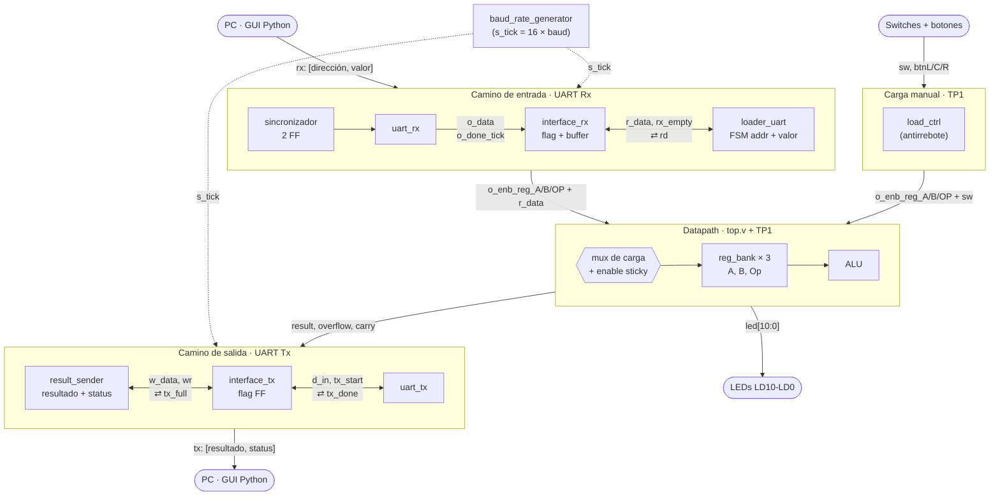
```mermaid
flowchart TB
    PCIN(["PC · GUI Python"])
    SW(["Switches + botones"])
    BRG["baud_rate_generator<br/>(s_tick = 16 × baud)"]

    subgraph ENTRADA["Camino de entrada · UART Rx"]
        direction LR
        SYNC["sincronizador<br/>2 FF"] --> RX["uart_rx"]
        RX -- "o_data<br/>o_done_tick" --> IFCRX["interface_rx<br/>flag + buffer"]
        IFCRX <-- "r_data, rx_empty<br/>⇄ rd" --> LOADER["loader_uart<br/>FSM addr + valor"]
    end

    subgraph MANUAL["Carga manual · TP1"]
        direction LR
        LC["load_ctrl<br/>(antirrebote)"]
    end

    subgraph DATAPATH["Datapath · top.v + TP1"]
        direction LR
        MUX{{"mux de carga<br/>+ enable sticky"}} --> REGBANK["reg_bank × 3<br/>A, B, Op"] --> ALU["ALU"]
    end

    subgraph SALIDA["Camino de salida · UART Tx"]
        direction LR
        SENDER["result_sender<br/>resultado + status"] <-- "w_data, wr<br/>⇄ tx_full" --> IFCTX["interface_tx<br/>flag FF"]
        IFCTX <-- "d_in, tx_start<br/>⇄ tx_done" --> TX["uart_tx"]
    end

    PCOUT(["PC · GUI Python"])
    LEDS(["LEDs LD10-LD0"])

    PCIN -- "rx: [dirección, valor]" --> ENTRADA
    SW -- "sw, btnL/C/R" --> MANUAL
    BRG -. "s_tick" .-> ENTRADA
    BRG -. "s_tick" .-> SALIDA
    ENTRADA -- "o_enb_reg_A/B/OP + r_data" --> DATAPATH
    MANUAL -- "o_enb_reg_A/B/OP + sw" --> DATAPATH
    DATAPATH -- "result, overflow, carry" --> SALIDA
    DATAPATH -- "led[10:0]" --> LEDS
    SALIDA -- "tx: [resultado, status]" --> PCOUT
```

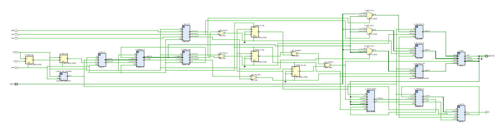

### Módulos

Todas las FSMs del diseño tienen la misma estructura de **3 procesos**, como pide la sección 2 de la consigna:

1. `always @(posedge clk)`: registro de estado y de los registros internos (contadores, shift register, etc.).
2. `always @(*)`: lógica de próximo estado (`state_next` y el "próximo valor" de cada registro interno).
3. `always @(*)`: lógica de salida.

Los estados se nombran con `localparam` y cada `case` tiene un `default` que vuelve al estado inicial (_fault recovery_).

#### `baud_rate_generator.v`

Contador módulo `N` que genera un pulso `s_tick` 16 veces por bit (sobremuestreo `OVERSAMPLE=16`). Con el clock de la Basys3 y el baud rate elegido:

```
N = CLK_FREQ / (BAUD_RATE × OVERSAMPLE) = 100.000.000 / (19.200 × 16) = 325 (truncado)
```

El error por el truncado es de 0,16 % (baud real ≈ 19.230), muy por debajo de la tolerancia típica de una UART (~2 %). Rx y Tx comparten el mismo generador.

#### `uart_rx.v`

Traducción del diagrama ASM de la consigna: FSM de 4 estados (`IDLE → START → DATA → STOP`). Usa un contador de ticks dentro del bit (`s`), un contador de bits recibidos (`n`) y un shift register (`b`) que arma el byte LSB primero. El start bit se confirma en su punto medio (tick 7): si la línea volvió a 1, se trata como ruido y la FSM vuelve a `IDLE` sin generar `o_done_tick`.

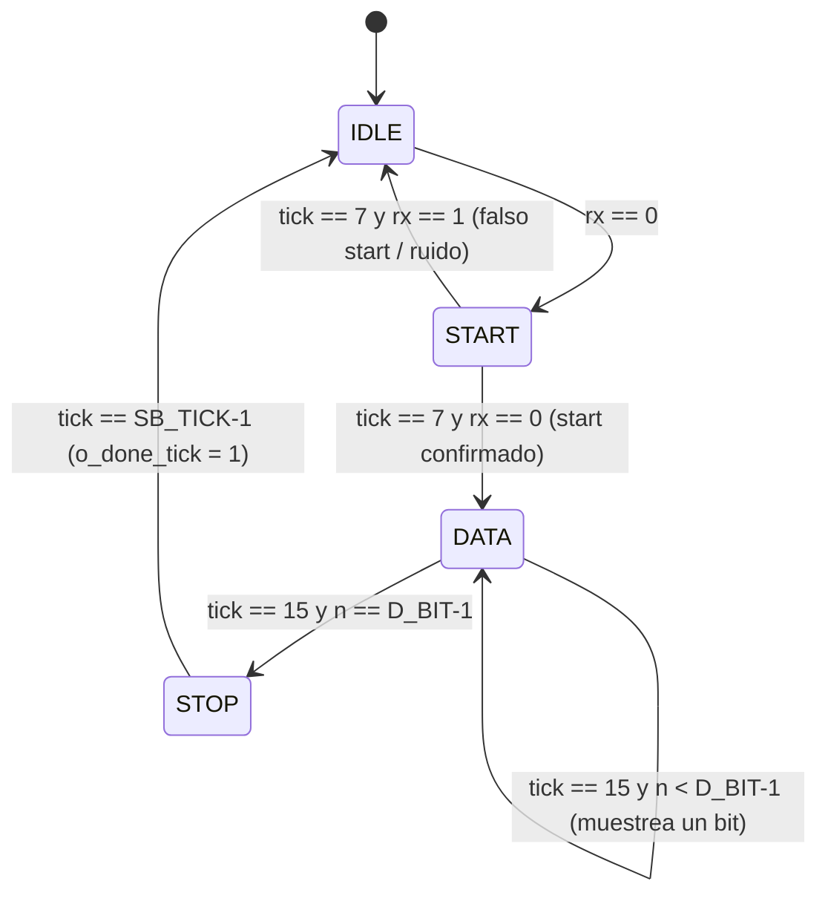
```mermaid
stateDiagram-v2
    [*] --> IDLE
    IDLE --> START: rx == 0
    START --> DATA: tick == 7 y rx == 0 (start confirmado)
    START --> IDLE: tick == 7 y rx == 1 (falso start / ruido)
    DATA --> DATA: tick == 15 y n < D_BIT-1 (muestrea un bit)
    DATA --> STOP: tick == 15 y n == D_BIT-1
    STOP --> IDLE: tick == SB_TICK-1 (o_done_tick = 1)
```

Parámetros: `D_BIT=8`, `SB_TICK=16` (1 stop bit), **sin bit de paridad** (es opcional en la consigna y el protocolo de más abajo ya valida cada trama por su dirección). Es decir, formato **8N1**.

En `top.v`, la entrada `rx` pasa primero por un **sincronizador de 2 flip-flops** (con el atributo `ASYNC_REG`), porque viene de la PC, que no comparte el clock de la FPGA, y podría provocar metaestabilidad. Los 2 ciclos de demora que agrega son despreciables frente a los ~5200 ciclos que dura cada bit.

#### `uart_tx.v`

FSM análoga a la de Rx, en sentido inverso: al recibir `tx_start` en `IDLE` carga `d_in` en un shift register y arma la trama bit a bit (start, 8 datos LSB primero, stop), mantiene cada bit durante 16 ticks y genera un pulso `tx_done` al terminar.

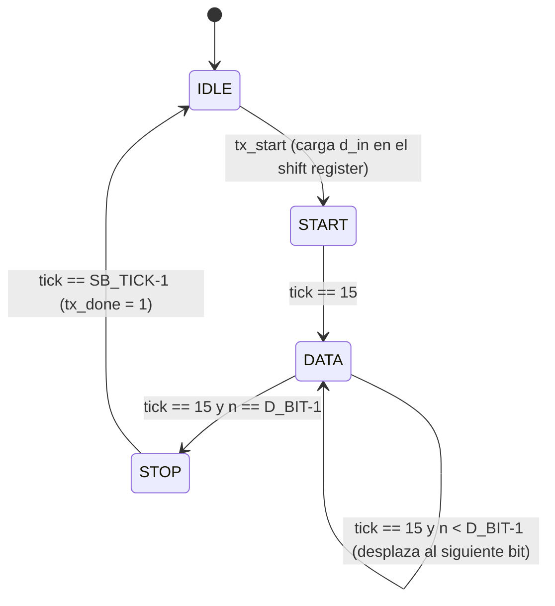
```mermaid
stateDiagram-v2
    [*] --> IDLE
    IDLE --> START: tx_start (carga d_in en el shift register)
    START --> DATA: tick == 15
    DATA --> DATA: tick == 15 y n < D_BIT-1 (desplaza al siguiente bit)
    DATA --> STOP: tick == 15 y n == D_BIT-1
    STOP --> IDLE: tick == SB_TICK-1 (tx_done = 1)
```

La salida `tx` es **registrada** (`tx_reg`) para evitar glitches en el pin físico, y está en 1 (reposo) en el reset.

#### `interface_rx.v` — Interface Circuit, lado Rx

Esquema **flag FF + buffer de una palabra** (módulo `flag_buf` del libro de referencia, `docs/FPGAPrototypingByVerilogExamples.pdf`, sección 8.2.4). `o_done_tick` de `uart_rx` guarda el byte en el buffer y levanta el flag; el consumidor lee `o_r_data` cuando `o_rx_empty=0` y pulsa `i_rd` para bajar el flag.

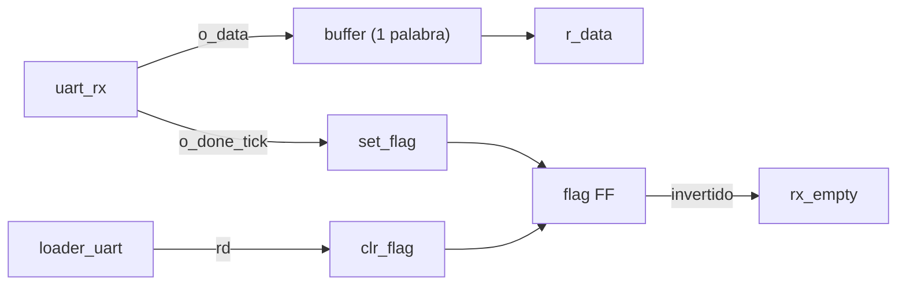
```mermaid
flowchart LR
    RX["uart_rx"] -- "o_data" --> BUF["buffer (1 palabra)"]
    RX -- "o_done_tick" --> SETFLAG["set_flag"]
    SETFLAG --> FLAG["flag FF"]
    FLAG -- "invertido" --> EMPTY["rx_empty"]
    BUF --> RDATA["r_data"]
    LOADER["loader_uart"] -- "rd" --> CLRFLAG["clr_flag"]
    CLRFLAG --> FLAG
```

| Puerto | Dirección | Descripción |
|---|---|---|
| `clk`, `reset` | in | — |
| `i_rx_data[7:0]` | in | `o_data` de `uart_rx.v` |
| `i_rx_done_tick` | in | `o_done_tick` de `uart_rx.v` (`set_flag`) |
| `i_rd` | in | pulso de 1 ciclo "ya leí el dato" (`clr_flag`), de `loader_uart.v` |
| `o_r_data[7:0]` | out | dato bufferizado |
| `o_rx_empty` | out | `~flag_reg` |

#### `interface_tx.v` — Interface Circuit, lado Tx

Esquema **flag FF simple**: `i_wr` guarda el dato y levanta `o_tx_full`; `tx_done` de `uart_tx` lo baja. `o_tx_start` es un nivel que se mantiene mientras el flag está arriba (`uart_tx` solo lo toma cuando está en `IDLE`).

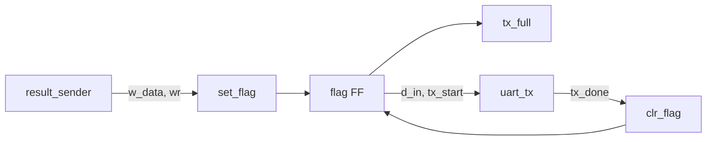
```mermaid
flowchart LR
    SENDER["result_sender"] -- "w_data, wr" --> SETFLAG["set_flag"]
    SETFLAG --> FLAG["flag FF"]
    FLAG --> TXFULL["tx_full"]
    FLAG -- "d_in, tx_start" --> TX["uart_tx"]
    TX -- "tx_done" --> CLRFLAG["clr_flag"]
    CLRFLAG --> FLAG
```

| Puerto | Dirección | Descripción |
|---|---|---|
| `clk`, `reset` | in | — |
| `i_w_data[7:0]` | in | dato a transmitir |
| `i_wr` | in | pulso de 1 ciclo "quiero transmitir esto" (`set_flag`), de `result_sender.v` |
| `i_tx_done` | in | de `uart_tx.v` (`clr_flag`) |
| `o_tx_full` | out | `flag_reg` |
| `o_d_in[7:0]`, `o_tx_start` | out | hacia `uart_tx.v` |

#### `loader_uart.v`

FSM de 2 estados (`WAIT_CMD` / `WAIT_VALUE`) que implementa el [protocolo de direccionamiento](#protocolo-uart) del lado de la FPGA. Lee de `interface_rx` el byte de dirección, lo guarda en `addr_reg` y, cuando llega el byte de valor, pulsa durante 1 ciclo el `o_enb_reg_A/B/OP` correspondiente.

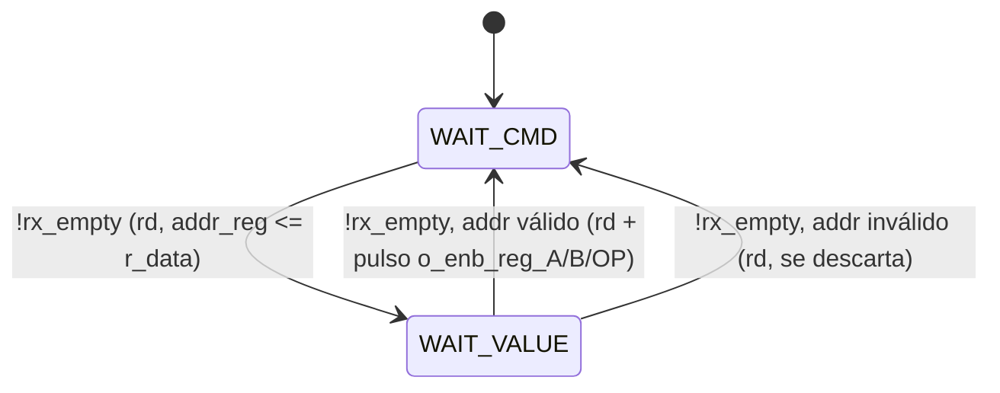
```mermaid
stateDiagram-v2
    [*] --> WAIT_CMD
    WAIT_CMD --> WAIT_VALUE: !rx_empty (rd, addr_reg <= r_data)
    WAIT_VALUE --> WAIT_CMD: !rx_empty, addr válido (rd + pulso o_enb_reg_A/B/OP)
    WAIT_VALUE --> WAIT_CMD: !rx_empty, addr inválido (rd, se descarta)
```

Las salidas son de tipo Mealy: `o_rd` y el `o_enb_reg_*` pulsan en el mismo ciclo en que `i_rx_empty=0`, así que el pulso de carga coincide con `r_data` = valor y el `reg_bank` lo captura directamente del bus de `interface_rx`. Con una dirección inválida el byte de valor se consume igual pero no se carga nada: se descarta la trama completa sin desfasar la siguiente.

| Puerto | Dirección | Descripción |
|---|---|---|
| `clk`, `reset` | in | — |
| `i_r_data[7:0]`, `i_rx_empty` | in | de `interface_rx.v` |
| `o_rd` | out | pulso de 1 ciclo hacia `interface_rx.v` |
| `o_enb_reg_A`, `o_enb_reg_B`, `o_enb_reg_OP` | out | pulsos de 1 ciclo hacia el mux de `top.v` |

#### `result_sender.v`

FSM de 3 estados (`IDLE` / `SEND_RESULT` / `SEND_STATUS`) que observa `{result, overflow, carry}` de la ALU y, cada vez que cambia algo, manda 2 bytes por `interface_tx`:

- byte 1 = `o_result[7:0]`
- byte 2 = status = `{6'b0, o_overflow, o_carry}`

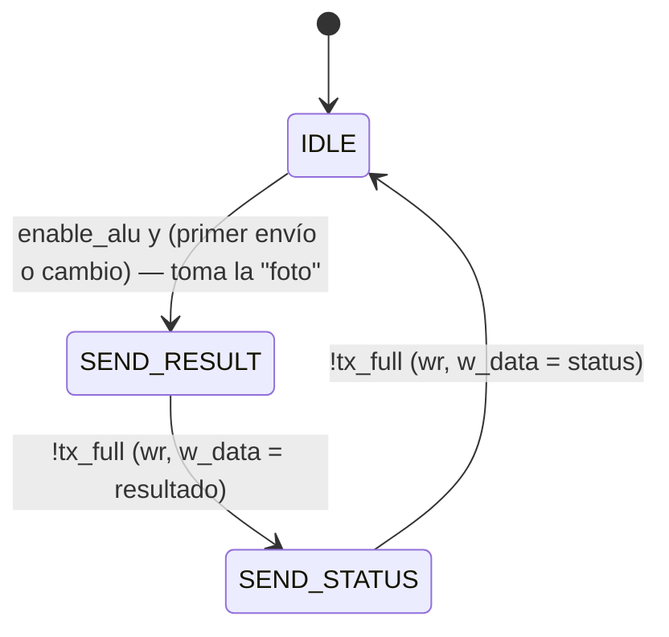
```mermaid
stateDiagram-v2
    [*] --> IDLE
    IDLE --> SEND_RESULT: enable_alu y (primer envío o cambio) — toma la "foto"
    SEND_RESULT --> SEND_STATUS: !tx_full (wr, w_data = resultado)
    SEND_STATUS --> IDLE: !tx_full (wr, w_data = status)
```

- **Gate por `i_enable_alu`**: no manda nada hasta que A, B y Op se cargaron al menos una vez.
- **Primer envío garantizado** (`sent_once`): sin esta condición, si la ALU se habilita con resultado `0x00` (igual al valor inicial guardado tras el reset) el módulo nunca enviaría nada.
- **"Foto" (snapshot)**: al salir de `IDLE` se copian resultado y status, y los 2 bytes se mandan desde esa copia. Si la ALU cambia a mitad de la transmisión, los 2 bytes de un mismo envío siempre corresponden al mismo cálculo; los cambios intermedios se descartan y al volver a `IDLE` se envía solo el último valor.
- **Handshake**: `o_wr` solo se pulsa con `i_tx_full=0`, nunca se escribe con el buzón ocupado.

#### `top.v`

Instancia todo lo anterior, junto con los módulos de TP1, y resuelve la convivencia de las dos fuentes de carga:

- **Enable de cada registro**: OR de los pulsos de las dos fuentes (`enb_reg_X = enb_reg_X_uart | enb_reg_X_sw`).
- **Dato de cada registro**: si pulsó la fuente de switches toma `sw`; si no, toma `r_data` de la UART. Para Op se usan los 6 bits menos significativos.
- **Enable de la ALU**: 3 flags _sticky_ (`loaded_a/b/op`), igual que en `load_ctrl.v` de TP1, pero levantados por **cualquiera** de las dos fuentes. Si cada fuente calculara su propio sticky y recién se combinaran al final, una carga mixta (A por switch y B/Op por UART) nunca habilitaría la ALU. Por eso el `o_enable_alu` propio de `load_ctrl.v` queda sin conectar.
- **LEDs**: mismo formato que TP1, `led[7:0]` = resultado, `led[8]` apagado (separador), `led[9]` = overflow, `led[10]` = carry.

## Protocolo UART

**Trama física**: 19200 baud, 8N1 (1 start bit, 8 bits de datos LSB primero, sin paridad, 1 stop bit).

**PC → FPGA**: cada carga es un par de bytes `[dirección, valor]`. Una GUI no tiene "un pulsador por campo", así que tiene que indicar explícitamente a qué registro va cada valor. Esto también permite actualizar un solo operando sin reenviar los otros.

| Dirección (byte 1) | Destino | Valor (byte 2) |
|---|---|---|
| `0x01` | Op | 6 bits menos significativos = opcode de la ALU |
| `0x02` | A | operando A (8 bits) |
| `0x03` | B | operando B (8 bits) |
| otra | — | se descarta el par completo (fault recovery) |

**FPGA → PC**: 2 bytes `[resultado, status]`, con `status = {6'b0, overflow, carry}`, enviados automáticamente cada vez que cambia la salida de la ALU (no hay comando de lectura). Si una carga no cambia el resultado (por ejemplo, recargar A con el mismo valor) no se envía nada, así que la GUI lee con timeout.

**Sin comando `EXEC`**: igual que en TP1, la ALU queda habilitada (sticky) apenas A, B y Op se cargaron alguna vez, en cualquier orden, y al ser combinacional recalcula sola con cada recarga. Como consecuencia, al recargar los 3 campos seguidos con la ALU ya habilitada, cada carga dispara su propia respuesta intermedia (ver [GUI](#gui-en-python)).

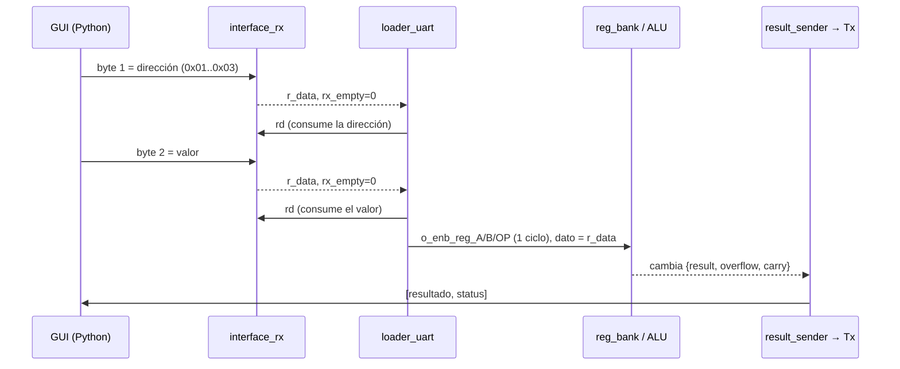
```mermaid
sequenceDiagram
    participant GUI as GUI (Python)
    participant IFC as interface_rx
    participant LD as loader_uart
    participant RB as reg_bank / ALU
    participant RS as result_sender → Tx

    GUI->>IFC: byte 1 = dirección (0x01..0x03)
    IFC-->>LD: r_data, rx_empty=0
    LD->>IFC: rd (consume la dirección)
    GUI->>IFC: byte 2 = valor
    IFC-->>LD: r_data, rx_empty=0
    LD->>IFC: rd (consume el valor)
    LD->>RB: o_enb_reg_A/B/OP (1 ciclo), dato = r_data
    RB-->>RS: cambia {result, overflow, carry}
    RS->>GUI: [resultado, status]
```

## Decisiones de diseño

| Decisión | Elección | Motivo |
|---|---|---|
| Baud rate / clock | 19200 baud, 100 MHz → `N = 325` | Clock de la Basys3; 19200 es el valor usado en clase |
| Formato de trama | 8N1 | 8 bits = 1 byte por operando; la paridad es opcional y el protocolo ya descarta direcciones inválidas |
| Interface Circuit Rx | flag FF + buffer de 1 palabra | Evita exponer el registro interno del receptor (riesgo de pisarlo con una trama nueva antes de leerlo). Una FIFO sería más lógica que la que pide la consigna ("protocolo simple de handshake"). Los nombres de señal de la consigna (`r_data`, `rd`, `rx_empty`) coinciden con este esquema |
| Interface Circuit Tx | flag FF simple, se limpia con `tx_done` | La GUI manda comandos a ritmo humano, así que un buffer extra no aporta nada. Además, este esquema no requiere modificar `uart_tx.v` |
| Protocolo de carga | `[dirección, valor]`, sin `EXEC` | Reproduce la carga libre y el enable sticky de TP1 |
| Respuesta | 2 bytes automáticos `[resultado, status]` | No se pierden overflow/carry y la GUI no necesita pedir el resultado |
| Enable de la ALU | sticky unificado en `top.v` | Permite cargas mixtas switch/UART. `load_ctrl.v` no se instancia para la UART porque su antirrebote solo agregaría demora a pulsos que ya llegan limpios |
| Reutilización de TP1 | `ALU.v`, `reg_bank.v`, `load_ctrl.v`, `debounce.v` sin cambios | La interfaz de `reg_bank` (`i_data` + `i_load_reg` de 1 ciclo) ya es lo que necesita `loader_uart` |
| Estructura de módulos | sin wrapper `uart.v`; `interface_rx`/`interface_tx` conectados directo a `uart_rx`/`uart_tx` en `top.v` | Un nivel de jerarquía menos, sin perder la separación por bloque que pide la consigna |

## Mapeo de pines (Basys3)

Definido en `constraints/constraints.xdc`:

| Señal       | Función                                  | Pines Basys3                               |
| ----------- | ---------------------------------------- | ------------------------------------------ |
| `clk`       | Clock de 100 MHz                         | W5                                         |
| `reset`     | Reset síncrono                           | Botón inferior del d-pad (`btnD`, pin U17) |
| `rx`        | Línea serie PC → FPGA (USB-RS232, RsRx)  | B18                                        |
| `tx`        | Línea serie FPGA → PC (USB-RS232, RsTx)  | A18                                        |
| `sw[7:0]`   | Dato (A/B) u opcode (SW5-SW0)            | SW7-SW0                                    |
| `btnL`      | Cargar A por switches                    | Botón izquierdo                            |
| `btnC`      | Cargar B por switches                    | Botón central                              |
| `btnR`      | Cargar Op por switches                   | Botón derecho                              |
| `led[10:0]` | Resultado + separador + overflow + carry | LD10-LD0                                   |

La UART usa el mismo cable micro-USB de programación de la placa (puente FTDI USB-serie), que en Linux aparece como `/dev/ttyUSBx`.

## Verificación

Todos los testbenches son **autochequeados**: comparan automáticamente lo esperado contra lo obtenido e imprimen `[OK]`/`[FAIL]` por caso y un resumen final. Se corrieron con Icarus Verilog y con el simulador de Vivado.

### Testbenches por módulo

- **`tb_baud_rate_generator.v`**: mide los ciclos de clock entre ticks consecutivos y verifica que los 16 intervalos de un período de bit duren exactamente 325 ciclos.
- **`tb_uart_rx.v`**: 2 tramas válidas (`0xA5`, `0x3C`) con `o_data` correcto y `o_done_tick` pulsando exactamente 1 vez. Un glitch en el start bit (falso start) se ignora correctamente, y la trama válida que llega después (`0x5A`) se recibe bien.
- **`tb_uart_tx.v`**: 2 tramas completas verificadas **tick a tick** (valor de `tx` en cada uno de los 16 ticks de cada bit: start, 8 datos, stop), más `tx_done` pulsando exactamente 1 vez y `tx` volviendo al reposo.
- **`tb_interface_rx.v`**: 13 casos: estado post-reset, llegada de dato, persistencia mientras no se lee, lectura con `i_rd`, segunda trama, reset con dato pendiente, `i_rx_done_tick` e `i_rd` en el mismo ciclo, y _overrun_ (el buffer queda con el dato más reciente).
- **`tb_interface_tx.v`**: 10 chequeos: estado post-reset, carga de dato, `tx_full` estable mientras transmite, `tx_done` limpia el flag, segundo envío, reset a mitad de transmisión, `i_wr` e `i_tx_done` en el mismo ciclo.
- **`tb_loader_uart.v`**: 13 casos con un modelo de `interface_rx`: carga de A/B/Op en distintos órdenes, direcciones inválidas (`0x07`, `0x00`, `0x04`) descartadas sin trabar la FSM, espera larga entre dirección y valor, reset en `WAIT_VALUE` y bytes _back-to-back_. Un monitor verifica en todos los ciclos que nunca hay más de un `o_enb_reg_*` activo, que ninguno dura más de 1 ciclo y que `o_rd` y los enables solo se activan con dato disponible.
- **`tb_result_sender.v`** (_loopback_ Tx → Rx): prueba la **cadena de salida real** `result_sender → interface_tx → uart_tx → uart_rx`, con `uart_rx` haciendo de "PC" que decodifica lo que sale por la línea. Son 11 casos: sin `enable_alu` no manda nada, primer envío con resultado `0x00`, cambio de resultado, valor repetido (no reenvía), overflow/carry en el byte de status, cambio de la ALU a mitad del envío (la foto mantiene el par consistente), cambios intermedios descartados y reset a mitad de un envío. Un monitor verifica que `o_wr` nunca se pulsa con `i_tx_full=1`.

#### Formas de onda de `uart_rx` y `uart_tx`

**`tb_uart_rx.v`**: comienzo de la recepción de `0xA5`. Después del reset, `in_rx` cae a 0 (start bit) y la FSM toma cada bit en el punto medio, contando los pulsos de `i_tick`. `o_data` va armando el byte LSB primero (`0x01`, `0x05`, …), y en la consola se ven todos los casos aprobados:

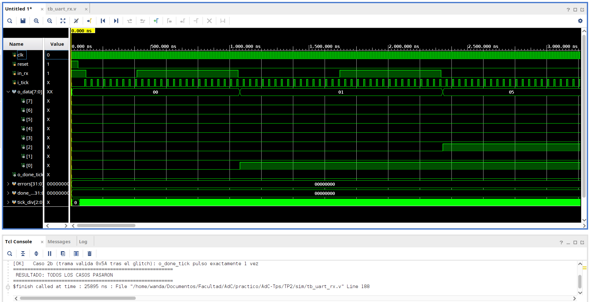

**`tb_uart_tx.v`**: comienzo de la transmisión de `0xA5`. Con `tx_start`, `uart_tx` copia `d_in` a su shift register. Justo después, el testbench cambia `d_in` a su complemento (`0x5A`) para comprobar que la trama sale del dato capturado y no del bus. `tx` baja a 0 durante 16 ticks (start bit) y vuelve a 1 con el primer bit de datos (bit 0 de `0xA5` = 1):

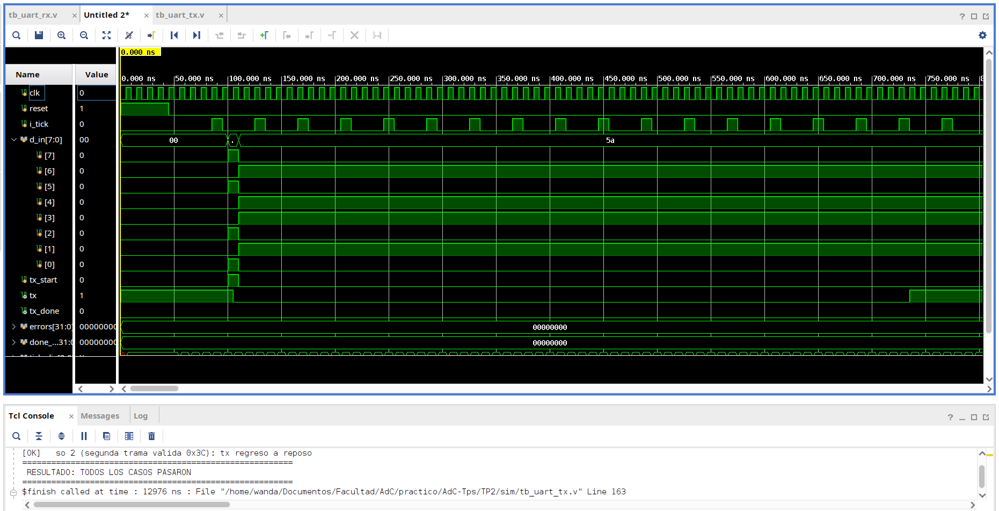

### `tb_top.v` — sistema completo

Prueba `top.v` de punta a punta como lo usaría la PC: manda bytes reales **bit a bit por `rx`** a la velocidad de la placa (19200 baud con clock de 100 MHz, 52 µs por bit) y decodifica lo que sale por `tx` con un **receptor propio del testbench** (no usa `uart_rx`), para que la verificación no dependa del diseño bajo prueba. También ejercita la carga por switches/pulsadores, con `N_DEBOUNCE` reducido solo para la simulación.

| Caso | Qué verifica |
|---|---|
| 1 | Post-reset: `tx` en reposo, LEDs apagados, nada sale por `tx` |
| 2 | A y B cargados sin Op: los registros se cargan pero no hay respuesta (ALU sin habilitar) |
| 3 | Op = ADD habilita la ALU: llega `5 + 3 = 0x08`, status `0x00`, y los LEDs lo muestran |
| 4 | Overflow: `5 + 127` satura en `0x7F`, status `0x02`, LED de overflow encendido |
| 5 | Cambio de opcode a SUB: `5 - 127 = 0x86` |
| 6 | Recargar A con el mismo valor: no hay respuesta |
| 7 | Dirección inválida `0x07`: se descarta sin tocar los registros y el comando siguiente se decodifica bien |
| 8 | Carry: `0xFF + 0x01 = 0x00`, status `0x01` |
| 9 | Comandos seguidos sin pausa (como los manda la GUI): las respuestas llegan en pares completos y consistentes, y la última es la cuenta final |
| 10 | A recargado **por switch** sobre B/Op cargados por UART: `0x05 + 0x20 = 0x25`, también enviado por UART |
| 11 | Carga mixta después de un reset: A por switch, B y Op por UART. La ALU se habilita recién con los 3 y responde `0x0F - 0x05 = 0x0A` |
| 12 | B recargado por switch pisa el valor de UART: `0x0F - 0x0A = 0x05` |

Formas de onda de los casos 2 a 5, con carga por UART. Por `rx` entran los pares `[dirección, valor]` y por `tx` salen las respuestas. `rbyte`/`rx_count` son los bytes que decodifica el receptor del testbench. Los LEDs pasan de `0x000` (ALU sin habilitar) a `0x008` (`5 + 3`), `0x27F` (`5 + 127` saturado, con LD9 de overflow) y `0x086` (`5 - 127`):

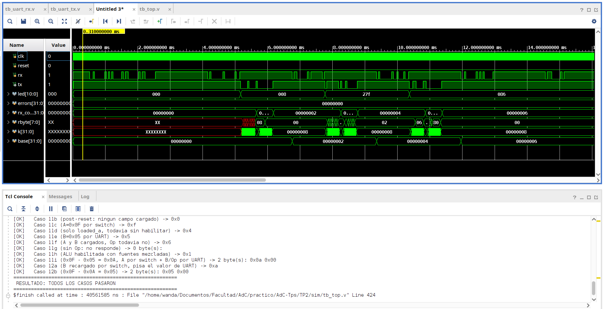

Forma de onda del caso 10: con `sw = 0x05` se pulsa `btnL`. Los LEDs pasan de `0x030` a `0x025` y enseguida `tx` empieza a transmitir la respuesta `[0x25, 0x00]`.

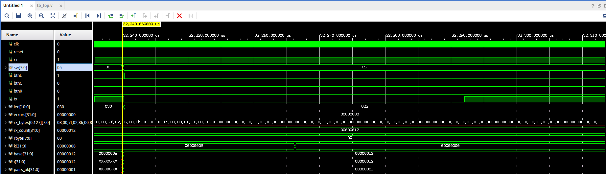

Resultado en consola:

```
========================================================
 Testbench top TP2 (UART + switches) - 19200 baud, 52000 ns por bit, N_DEBOUNCE(sim)=4
========================================================
[OK]   Caso 1a (post-reset: tx en reposo) -> 0x1
[OK]   Caso 1b (post-reset: LEDs apagados) -> 0x0
[OK]   Caso 1c (post-reset: no sale nada por tx) -> 0 byte(s):
[OK]   Caso 2a (A y B sin Op: no responde) -> 0 byte(s):
[OK]   Caso 2b (registro A cargado) -> 0x5
[OK]   Caso 2c (registro B cargado) -> 0x3
[OK]   Caso 3a (Op=ADD: 5 + 3) -> 2 byte(s): 0x08 0x00
[OK]   Caso 3b (LEDs muestran el resultado) -> 0x8
[OK]   Caso 4a (5 + 127: overflow, status 0x02) -> 2 byte(s): 0x7f 0x02
[OK]   Caso 4b (LED de overflow encendido) -> 0x27f
[OK]   Caso 5 (Op=SUB: 5 - 127 = 0x86) -> 2 byte(s): 0x86 0x00
[OK]   Caso 6 (A=5 otra vez: no responde) -> 0 byte(s):
[OK]   Caso 7a (direccion 0x07: se descarta) -> 0 byte(s):
[OK]   Caso 7b (registros sin cambios: A, B, Op) -> 0x57f22
[OK]   Caso 7c (comando siguiente bien: 10 - 127 = 0x8B) -> 2 byte(s): 0x8b 0x00
[OK]   Caso 8 (0xFF + 0x01: carry, status 0x01) -> 2 byte(s): 0x00 0x01
[OK]   Caso 9a (comandos seguidos: 2 respuesta(s) en pares completos)
[OK]   Caso 9b (cada par es una cuenta valida: resultado y status de la misma cuenta)
[OK]   Caso 9c (ultima respuesta = cuenta final 0x10 + 0x20) -> 2 byte(s): 0x30 0x00
[OK]   Caso 10a (A cargado por switch) -> 0x5
[OK]   Caso 10b (0x05 + 0x20 = 0x25, por switch) -> 2 byte(s): 0x25 0x00
[OK]   Caso 11a (post-reset: LEDs apagados) -> 0x0
[OK]   Caso 11b (post-reset: ningun campo cargado) -> 0x0
[OK]   Caso 11c (A=0x0F por switch) -> 0xf
[OK]   Caso 11d (solo loaded_a, todavia sin habilitar) -> 0x4
[OK]   Caso 11e (B=0x05 por UART) -> 0x5
[OK]   Caso 11f (A y B cargados, Op todavia no) -> 0x6
[OK]   Caso 11g (sin Op: no responde) -> 0 byte(s):
[OK]   Caso 11h (ALU habilitada con fuentes mezcladas) -> 0x1
[OK]   Caso 11i (0x0F - 0x05 = 0x0A, A por switch + B/Op por UART) -> 2 byte(s): 0x0a 0x00
[OK]   Caso 12a (B recargado por switch, pisa el valor de UART) -> 0xa
[OK]   Caso 12b (0x0F - 0x0A = 0x05) -> 2 byte(s): 0x05 0x00
========================================================
 RESULTADO: TODOS LOS CASOS PASARON
========================================================
```

### Tests de la GUI

`gui/test_mock_alu.py` compara el modelo de la ALU usado por el modo mock de la GUI contra los mismos casos dirigidos de `TP1/sim/tb_ALU.v`, y `gui/test_protocol.py` prueba el parseo y formateo de valores (decimal con signo, hex, binario, rangos). **19/19 tests pasan.**

## Resultados

- **Testbenches de módulo**: `tb_baud_rate_generator`, `tb_uart_rx`, `tb_uart_tx`, `tb_interface_rx`, `tb_interface_tx`, `tb_loader_uart` y `tb_result_sender` (loopback Tx → Rx) pasan todos sus casos.
- **`tb_top.v`**: **32/32 chequeos pasaron** (12 casos, incluyendo carga mixta switch/UART y comandos _back-to-back_).
- **GUI**: 19/19 tests unitarios pasan.
- Síntesis, implementación y generación de bitstream completadas sin errores en Vivado; **validado en hardware** sobre la Basys3 con la GUI conectada por el puerto USB-serie (ver [Guía de casos de prueba](#guía-de-casos-de-prueba-en-la-fpga)).
- Timing Summary post-implementación sin violaciones: **WNS 1.472 ns / WHS 0.155 ns / WPWS 4.500 ns, 0 endpoints fallando** en Setup, Hold y Pulse Width ("All user specified timing constraints are met").

  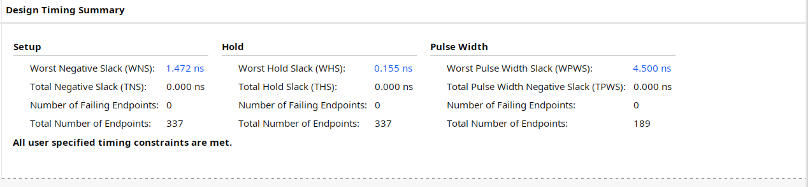

  **Setup**: WNS 1.472 ns, TNS 0.000 ns, 0/337 endpoints fallando. **Hold**: WHS 0.155 ns, THS 0.000 ns, 0/337 endpoints fallando. **Pulse Width**: WPWS 4.500 ns, TPWS 0.000 ns, 0/189 endpoints fallando.

## Cómo simular / sintetizar

### Vivado

1. Agregar como fuentes de diseño todos los archivos de `rtl/`.
2. Agregar el testbench deseado de `sim/` como fuente de simulación y correr la simulación de comportamiento. `tb_top.v` simula ~40 ms de tiempo real (tramas a 19200 baud), así que conviene aumentar el _runtime_ de la simulación o usar `run all`.
3. Para hardware: agregar `constraints/constraints.xdc`, correr síntesis + implementación, generar el bitstream y programar la Basys3.

### Icarus Verilog

Desde `TP2/`:

```
iverilog -o /tmp/tb.vvp sim/tb_baud_rate_generator.v rtl/baud_rate_generator.v && vvp /tmp/tb.vvp
iverilog -o /tmp/tb.vvp sim/tb_uart_rx.v rtl/uart_rx.v && vvp /tmp/tb.vvp
iverilog -o /tmp/tb.vvp sim/tb_uart_tx.v rtl/uart_tx.v && vvp /tmp/tb.vvp
iverilog -o /tmp/tb.vvp sim/tb_interface_rx.v rtl/interface_rx.v && vvp /tmp/tb.vvp
iverilog -o /tmp/tb.vvp sim/tb_interface_tx.v rtl/interface_tx.v && vvp /tmp/tb.vvp
iverilog -o /tmp/tb.vvp sim/tb_loader_uart.v rtl/loader_uart.v && vvp /tmp/tb.vvp
iverilog -o /tmp/tb.vvp sim/tb_result_sender.v rtl/result_sender.v rtl/interface_tx.v rtl/uart_tx.v rtl/uart_rx.v && vvp /tmp/tb.vvp
iverilog -o /tmp/tb.vvp sim/tb_top.v rtl/*.v && vvp /tmp/tb.vvp
```

### GUI

```
cd TP2/gui
pip install pyserial
python3 app.py
python3 -m unittest test_mock_alu.py test_protocol.py -v   # tests
```

Detalle de la estructura de la GUI en [`gui/README.md`](gui/README.md).

## GUI en Python

Aplicación de escritorio en Tkinter (`gui/app.py`) que implementa el lado PC del protocolo:

- **Conexión**: puerto serie real (por ejemplo, `/dev/ttyUSB1`) o un modo **Mock (sin hardware)** que simula la ALU y el protocolo, y baud rate (19200 por defecto).
- **Carga de operandos**: A y B, cada uno con su formato (**Decimal** con signo, **Hex** o **Binario**) y una vista en vivo de cómo queda interpretado el byte; combo con las 8 operaciones y su opcode. Cada campo tiene su propio botón de carga (se puede recargar uno solo), más "Cargar los 3".
- **Resultado**: con y sin signo, A, B y Resultado alineados en binario para comparar operaciones bit a bit, e indicadores de Overflow/Carry (rojos cuando están activos). Como "Cargar los 3" manda 3 cargas separadas y cada una puede producir una respuesta intermedia, el panel de resultado espera a que la ráfaga se asiente (200 ms sin respuestas nuevas) y muestra la última.
- **Log**: todos los bytes enviados (`TX`, con la trama `[dirección valor]`) y recibidos (`RX`, con resultado y status decodificados).

Los modos real y mock exponen la misma interfaz (`write()`/`poll()`/`close()`), así que la GUI no distingue entre uno y otro.

## Guía de casos de prueba en la FPGA

Procedimiento general (ver [Mapeo de pines](#mapeo-de-pines-basys3)):

1. Programar la Basys3 y dejar el cable micro-USB conectado (el mismo cable lleva la UART).
2. Presionar **btnD** (reset): registros en 0, ALU deshabilitada, LEDs apagados.
3. Abrir la GUI, elegir el puerto `/dev/ttyUSBx` de la placa, baud 19200, y **Conectar**.
4. Ingresar A, B y la operación, y presionar **Cargar los 3** (o cada botón por separado, en cualquier orden).
5. Verificar el resultado y las banderas en la GUI **y** en los LEDs de la placa (`LD7-LD0` resultado, `LD9` overflow, `LD10` carry, `LD8` siempre apagado).

### Casos por operación (por UART)

Se usan los mismos casos de la guía de [TP1](../TP1/README.md#casos-por-operación), ahora cargados desde la GUI:

| #   | Operación                       | A           | B           | Op    | Resultado esperado | Status (ov, ca) |
| --- | ------------------------------- | ----------- | ----------- | ----- | ------------------ | --------------- |
| 1   | ADD básica                      | 10          | 20          | `ADD` | `0x1E` (30)        | `0x00` (0, 0)   |
| 2   | ADD, carry sin overflow         | -1          | 1           | `ADD` | `0x00` (0)         | `0x01` (0, 1)   |
| 3   | ADD, overflow positivo (satura) | 127         | 1           | `ADD` | `0x7F` (127)       | `0x02` (1, 0)   |
| 4   | ADD, overflow negativo (satura) | -128        | -128        | `ADD` | `0x80` (-128)      | `0x03` (1, 1)   |
| 5   | SUB, resultado positivo         | 20          | 10          | `SUB` | `0x0A` (10)        | `0x00`          |
| 6   | SUB, resultado negativo         | 10          | 20          | `SUB` | `0xF6` (-10)       | `0x00`          |
| 7   | AND                             | `11001100`  | `10101010`  | `AND` | `0x88`             | `0x00`          |
| 8   | OR                              | `11001100`  | `10101010`  | `OR`  | `0xEE`             | `0x00`          |
| 9   | XOR                             | `11001100`  | `10101010`  | `XOR` | `0x66`             | `0x00`          |
| 10  | SRA (extiende signo)            | `10000000`  | 2           | `SRA` | `0xE0` (-32)       | `0x00`          |
| 11  | SRL (no extiende signo)         | `10000000`  | 2           | `SRL` | `0x20` (32)        | `0x00`          |
| 12  | NOR                             | 0           | 0           | `NOR` | `0xFF`             | `0x00`          |

Capturas de la GUI conectada a la placa real (`/dev/ttyUSB1`):

**Caso 4 — ADD con overflow negativo y carry** (`-128 + -128`): satura en `0x80` y se encienden Overflow y Carry (status `0x03`). En el log se ven las respuestas intermedias de "Cargar los 3" (`0x81` con A ya cargado y B todavía de la operación anterior) antes de la final:

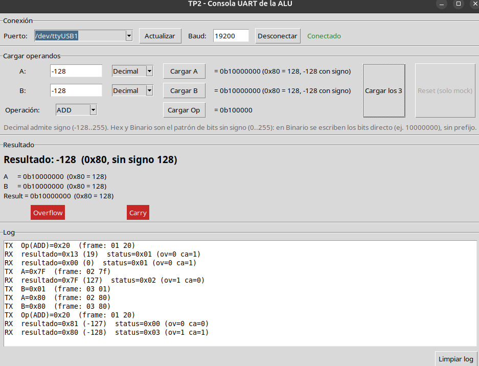

**Caso 6 — SUB con resultado negativo** (`10 - 20`): `0xF6` = -10, sin banderas:

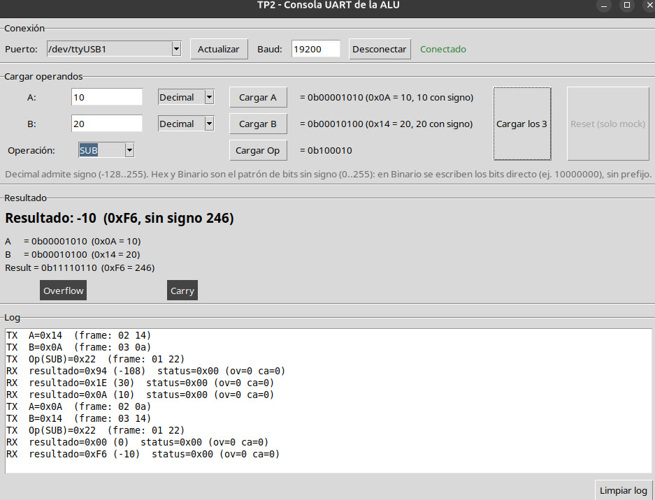

**Caso 7 — AND cargando los operandos en binario**: `11001100 AND 10101010 = 10001000` (`0x88`), con A, B y el resultado alineados bit a bit:

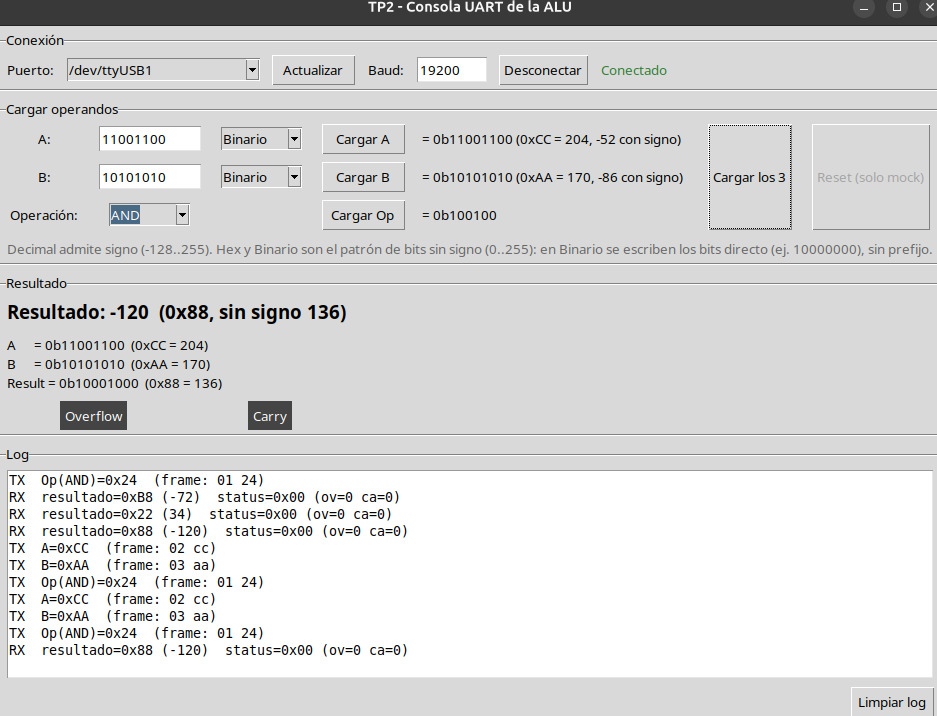

### Casos de protocolo y de carga mixta

| #   | Procedimiento                                                                                         | Resultado esperado                                                                                                              |
| --- | ----------------------------------------------------------------------------------------------------- | ------------------------------------------------------------------------------------------------------------------------------- |
| 13  | Después de un reset, cargar solo A y B desde la GUI                                                   | No llega ninguna respuesta y los LEDs quedan apagados (ALU sin habilitar hasta cargar Op)                                       |
| 14  | Con un resultado ya mostrado, cambiar solo la operación y presionar **Cargar Op**                     | Llega un único par `[resultado, status]` recalculado con los mismos A y B                                                       |
| 15  | Recargar A con el mismo valor que ya tenía                                                            | No llega ninguna respuesta (el resultado no cambió)                                                                            |
| 16  | Con un resultado ya mostrado por UART, poner un valor en **SW7-SW0** y presionar **btnL**             | Los LEDs **y** la GUI muestran el nuevo resultado: la carga por switch también dispara el envío por UART                        |
| 17  | Reset (**btnD**), cargar A por switches (**btnL**) y luego B y Op desde la GUI                         | La ALU se habilita recién al completar el tercer campo, aunque se hayan mezclado las dos fuentes                                |
